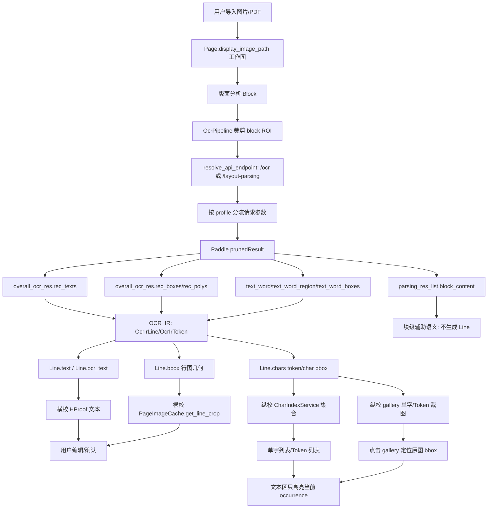

# OCR 逻辑链说明

本文档说明当前项目从 Paddle/API 请求到横校、纵校、集合和高亮的实际流转。目标是把“参数、字段、模型能力、项目处理链路”讲清楚，便于判断问题卡在哪一层。

## 1. 请求链

当前 API OCR 请求由 `app/engines/real_ocr_adapter.py::ApiOcrEngine._build_request_body()` 组装，端点由 `app/core/api_profiles.py::resolve_api_endpoint()` 统一解析：

- 如果用户保存的是完整端点 `/ocr` 或 `/layout-parsing`，直接使用该端点；
- 如果用户保存的是服务根地址，则按模型 profile 补端点：`pp-ocrv5 -> /ocr`，PP-StructureV3 / PaddleOCR-VL / VL-1.5 -> `/layout-parsing`；
- 这样版面分析可以用 PP-OCRv5 `/ocr` 的 `ocrResults` 合成文本块，也可以用 Structure/VL `/layout-parsing` 的结构块。
- `Authorization: token <api_token>`
- `Content-Type: application/json`

当前请求参数已经按模型 family 分流，不再四个模型套同一份 payload：

| profile | endpoint | request family | 会传的参数 | 不传/降级的参数 | 当前最大可信文本几何 |
| --- | --- | --- | --- | --- | --- |
| `pp-ocrv5` | `/ocr` | `ocr-word-box` | `returnWordBox`、坐标稳定开关、OCR 检测/识别阈值 | layout/VL/markdown 专用参数 | `word`；单字 token 才可信为 `char` |
| `pp-structurev3` | `/layout-parsing` | `ocr-word-box` | `returnWordBox`、坐标稳定开关、OCR 检测/识别阈值 | VL 专用理解参数；表格/公式/印章开关暂未开启 | `word`；单字 token 才可信为 `char`，另有 layout/block |
| `paddleocr-vl` | `/layout-parsing` | `vl-layout` | `file/fileType`、坐标稳定开关 | `returnWordBox`、OCR det/rec 阈值、unclip 等传统 OCR 参数 | `line`/block；不承诺 word/char |
| `paddleocr-vl-1.5` | `/layout-parsing` | `vl-layout` | `file/fileType`、坐标稳定开关 | `returnWordBox`、OCR det/rec 阈值、unclip 等传统 OCR 参数 | `line`/block；不承诺 word/char |

`ocr-word-box` family 当前实际调用的参数；其中三个坐标稳定开关也会发给 VL family，因为它们控制服务端预处理坐标空间，不属于传统 OCR detector/recognizer 参数：

| 参数 | 当前值 | 层级 | 目的 |
| --- | --- | --- | --- |
| `file` | base64 图片 | 输入 | OCR 输入图 |
| `fileType` | `1` | 输入 | 图片类型 |
| `returnWordBox` | `true` | token/word | 要求返回 `text_word/text_word_region`；返回的是 token/word，不天然等于真实 char |
| `useDocOrientationClassify` | `false` | 预处理 | 避免服务端旋转导致坐标漂移 |
| `useDocUnwarping` | `false` | 预处理 | 避免扭曲校正后坐标空间变化 |
| `useTextlineOrientation` | `false` | 行级 | 当前按原图坐标处理，不额外做行方向变换 |
| `textDetLimitSideLen` | `1536` | 检测 | 减少论文密集页被默认 960 下采样损伤 |
| `textDetLimitType` | `max` | 检测 | 仍按最长边限制，不改成 `min`，避免大页被放大到不可控尺寸 |
| `textDetThresh` | `0.3` | 检测 | 使用 Paddle 默认文字区域阈值，不额外抬高召回门槛 |
| `textDetBoxThresh` | `0.6` | 检测 | 提高检测框质量门槛，减少弱框/空框进入后链路 |
| `textDetUnclipRatio` | `2.0` | 检测 | 恢复 Paddle 默认框扩张语义；上一轮过低的 1.3 可能制造“边角料”式紧框 |
| `textRecScoreThresh` | `0.0` | 识别 | 不在服务端丢弃低分文本，低置信交给 proof/疑点队列处理 |

文档里提到但当前没有调用或只在部分模型调用的参数：

- `visualize`
- `logId`
- PP-StructureV3 的 `useSealRecognition/useTableRecognition/useFormulaRecognition/useChartRecognition/useRegionDetection`
- layout 相关的 `layoutThreshold/layoutNms/layoutUnclipRatio/layoutMergeBboxesMode`
- markdown/export 相关参数，如 `outputFormats/prettifyMarkdown/markdownIgnoreLabels`
- VL 模型不再发送 `returnWordBox/textDet*/textRec*`，因为这些传统 OCR detector/recognizer 参数对 VL layout endpoint 不一定生效，甚至可能被忽略或拒绝；但仍关闭 orientation/unwarping/textline orientation，避免版面坐标落到服务端变换后的画布。

当前没有调用这些参数的原因是：本轮只收口 OCR proof 主链和四模型能力分流，避免继续扩大模型/输出面；其中 layout、markdown、表格、公式识别属于块级结构或导出层，不应直接影响行级 `Line` 与纵校 token。

本轮重新看 PaddleOCR/PaddleX 参数后，结论是：继续靠事后几何规则修偏不是主方向。坐标可靠性首先取决于两件事：

1. 服务端不能改变输入图坐标空间，所以三个预处理开关继续关闭。
2. 对 OCR family，检测框不能被人为压得过紧，所以 `textDetUnclipRatio` 从 1.3 回到 Paddle 文档默认 2.0；过紧框会让 token/word bbox 只覆盖笔画边缘，后续 proof 再怎么裁都会像“邻字/边角料”。
3. 对 VL family，不把传统 OCR 参数硬塞进去，但坐标稳定开关仍要保留。VL 的价值在 layout/markdown/语义结构，若需要 word/char 几何，应和 PP-OCRv5/Structure 组成双模型链，而不是让 VL 假装能返回字框。

## 2. 响应链

当前项目重点读取 `result.layoutParsingResults[]` 和 `result.ocrResults[]` 下的 `prunedResult`。

| Paddle 字段 | 官方语义 | 项目流向 | 当前适配状态 |
| --- | --- | --- | --- |
| `overall_ocr_res.rec_texts` | 行级 OCR 文本 | `Line.text` / `Line.ocr_text` | 已适配，行级主链 |
| `overall_ocr_res.rec_scores` | 行级置信度 | `Line.confidence` / 自动疑点 | 已适配 |
| `overall_ocr_res.rec_boxes` | 行级 bbox | `Line.bbox` | 已适配 |
| `overall_ocr_res.rec_polys/rec_polygons/dt_polys` | 行级 polygon/bbox | `Line.bbox` | 已兼容 |
| `text_word` | token/字文本 | `Line.chars[*].token_text` | 已适配 |
| `text_word_region` / `text_word_boxes` | token/字坐标；Paddle 内部先生成 region，JSON 常导出 boxes | `Line.chars[*].bbox` | 已适配，二者等价进入 Inspector token bbox 链 |
| `parsing_res_list.block_content` | 块级结构文本 | 仅作为块级辅助语义 | 不升成 `Line` |
| `parsing_res_list.block_bbox/block_label` | 块级结构框/标签 | 版面结构层 | 不作为行级 bbox |
| `markdown.text` | 文档级/块级输出 | 当前 proof 主链不消费 | 未接入 proof |

核心标准：

- 块级：`parsing_res_list.block_content`
- 行级：`overall_ocr_res.rec_texts + rec_boxes/rec_polys`
- token/word 级：`text_word + text_word_region/text_word_boxes`
- proof 集合：基于 `Line.text + Line.chars`，但只索引有可靠几何的行

Inspector 侧也必须保持同一层级语义：`run_ocr.py` 的 API / 本地 Paddle / 本地 Structure flatten 现在会保留 `prunedResult.text_word` 与 `text_word_region/text_word_boxes` 顶层字段，不再只合并 `overall_ocr_res`。`PaddleAdapter` 同时读取 `prunedResult`、flatten 后顶层、`overall_ocr_res` 三个位置，并兼容 `textWord/textWordRegion/textWordBoxes` camelCase 别名。因此 `chars` 是否回显现在取决于响应里是否真的有 token/word region/boxes，而不是 flatten/parser 把字段丢掉。

本轮源码审计确认了一个易错点：PaddleX OCR pipeline 内部变量名是 `text_word_region`，但 `paddlex/inference/pipelines/ocr/result.py::OCRResult._to_json()` 对外 JSON 常写成 `text_word_boxes`。如果只盯 `text_word_region`，本地 Paddle 已经算出的 token 框会在 Inspector flatten/parser 层被误判为缺失。

已读取并用于判断的 PaddleOCR/PaddleX 源码点：

- `paddleocr/_pipelines/ocr.py::PaddleOCR.__init__` 与参数映射：`return_word_box` 会下发到 `SubModules.TextRecognition.return_word_box`，CLI 参数名为 `--return_word_box`。
- `paddlex/inference/serving/basic_serving/_pipeline_apps/ocr.py`：服务 API 将请求里的 `returnWordBox` 传给 `pipeline.infer(... return_word_box=...)`。
- `paddlex/inference/pipelines/ocr/pipeline.py`：`return_word_box=True` 时初始化 `text_word/text_word_region`，识别后调用 `cal_ocr_word_box()` 生成 token box，并再生成 `text_word_boxes`。
- `paddlex/inference/models/text_recognition/predictor.py` 与 `processors.py`：识别后处理返回 `word_list/word_col_list/state_list`；transformers engine 路径提示不支持 `return_word_box`。
- `paddlex/inference/pipelines/components/common/cal_ocr_word_box.py`：中文 `state == "cn"` 时按字符生成 char-ish box，多字符 token 仍可能是共享 word box。
- `paddlex/inference/pipelines/ocr/result.py::_to_json()`：对外 JSON 包含 `text_word_boxes/text_word`，这就是 Inspector 需要兼容 boxes alias 的直接原因。

## 3. 坐标转换链

当前统一按“输入图像像素空间”理解 Paddle 坐标：

1. **版面分析输入**：`Page.display_image_path` 对应的整页工作图。
2. **OCR 输入**：`OcrPipeline` 从整页工作图裁出的 block crop。
3. **Paddle 返回坐标**：在关闭 orientation/unwarping/textline orientation 后，坐标应落在“本次上传给 Paddle 的图像”上。版面阶段是 page-space；OCR 阶段是 crop-space。
4. **解析阶段**：`_bbox_from_region()` 支持 xyxy、四点 polygon、flat 8 数字 polygon、嵌套 polygon、dict alias，并按当前输入图尺寸 clamp。flat polygon 不能按前四个数当 xyxy，否则会把四边形误读成一条线。
5. **回写阶段**：`OcrPipeline` 只在 OCR 阶段把 crop-space line/char bbox 通过 crop seam 转成 page-space。proof 层不再猜 Paddle 坐标空间。
6. **画布/裁图阶段**：ImageViewer、横校 line crop、纵校 char crop 只消费 page-space bbox。

版面 API 另有一条 metadata 校验：如果响应带 `result.dataInfo.width/height`，优先用它判断 API 坐标画布；但若 raw bbox 已经明显超过该 metadata 画布、同时仍落在当前页面范围内，则判定 metadata 与 bbox 坐标空间矛盾，保持 `1.0` 不二次缩放。`input_img_shape/doc_preprocessor_res` 也走同一冲突保护，避免旧服务/不同模型返回冲突 metadata 时把 page-space 框再次放大造成偏移。只有 metadata 缺失或不矛盾时才退回 bbox 最大坐标启发式，这样也避免把“页面上本来没有靠右/靠下元素”误判成缩放。

## 4. OCR_IR 链

本轮新增 `app/core/ocr_ir.py`，把 Paddle raw JSON 和项目模型之间的语义显式拆开。它不是新的持久化模型，而是 OCR adapter 内部的中间表示，避免后续继续在 `rec_texts`、`text_word`、`Line`、纵校集合之间来回猜。

| 层级 | 对象 | 来源 | 作用 |
| --- | --- | --- | --- |
| Paddle raw | `overall_ocr_res.rec_texts/rec_boxes/rec_polys` | API 原始响应 | 行级主链 |
| Paddle raw | `text_word/text_word_region` | API 原始响应 | token/char 几何与 fallback 文本 |
| OCR_IR token | `OcrIrToken` | 单个 `text_word + region` | 保存 token 文本、bbox、kind、raw region |
| OCR_IR line | `OcrIrLine` | rec row 或 token row fallback | 保存 line 文本、bbox、source、review flags、tokens |
| 项目模型 | `Line/Char` | OCR_IR 转换 | 横校、纵校、导出消费的统一数据 |
| proof 集合 | `CharIndexService` | `Line.chars` | 再按字符、数字 token、公式 token 生成集合 |

映射规则：

1. 有 `rec_texts` 时，仍以 `rec_texts + rec_boxes/rec_polys` 生成 `OcrIrLine`，这符合行级主链标准。
2. `text_word/text_word_region` 只生成 `OcrIrToken`，通过 bbox overlap 挂到对应 `OcrIrLine`。
3. 如果行级 `rec_texts` 完全缺失，但 `text_word` 有可靠文本和 bbox，则生成 `OcrIrLine(source_text="text_word")`，并标记 `ir_token_text_fallback`。这是为“Paddle JSON 有文本但项目丢文本”的场景保底。
4. 如果已有 `rec_texts`，未匹配的 token row 不再额外升成新行，避免把错配/噪声 token 变成重复 OCR 文本。
5. OCR_IR 转 `Line` 后，横校只看 `Line.text + Line.bbox`，纵校只看 `Line.chars[*]`，集合/排序/高亮只看 `CharIndexService` 输出。

## 5. 处理链图

## 6. 参数与元素限制

当前能稳定拿到的元素：

| 模型/端点 | 当前能拿到 | 当前用途 | truthful granularity |
| --- | --- | --- | --- |
| PP-OCRv5 `/ocr` | `ocrResults[].overall_ocr_res.rec_texts/rec_boxes/rec_polys`，可选 `text_word/text_word_region` | 行级 OCR、版面阶段退化为文本块、proof token/word 框 | 无 `text_word_region` 时仅 line；多字 token 是 `word`，单字 token 才是 `char` |
| PP-StructureV3 `/layout-parsing` | `layout_det_res.boxes`、`parsing_res_list.block_*`、`overall_ocr_res`、`markdown`，可选 `text_word/text_word_region` | 主版面块、结构文本、OCR 主链 | layout/block + line；有 word region 时最多 `word` |
| PaddleOCR-VL `/layout-parsing` | layout/markdown/结构化解析，schema 与 Structure 接近但更偏文档理解 | 版面/结构候选，后续可用于公式、图表、复杂版面 | 当前按 line/block 消费，不伪造 word/char |
| PaddleOCR-VL-1.5 `/layout-parsing` | 与 VL 类似，偏文档理解和结构输出 | 版面/结构候选 | 当前按 line/block 消费，不伪造 word/char |

当前还拿不到或未正式消费的元素：

- 公式专用结构：已有 `formula/equation` 标签映射，但 proof 还没有公式面板；现在只在纵校集合层把公式 run 当 token。
- markdown 文档级输出：能从响应里看到，但 proof 主链不消费，避免 markdown 与行级 OCR 混层。
- 表格结构、印章、图表：版面可识别为 block，但没有专门校对/导出链。
- 每个字符的“真实置信度”：Paddle word box 主要提供位置，当前字符置信度仍继承行级分数。
- 真正逐字 bbox：只有当 `text_word` 中 token 本身长度为 1 且有对应 `text_word_region`，才标为 `bbox_granularity=char`；多字 token 共享框只标 `word`；没有 token region 时标 `fallback/unavailable`。

这些限制分别卡在：

1. **模型/端点层**：PP-OCRv5 没有 layout block；Structure/VL 有结构但 text_word 支持和字段完整性依服务版本而定。
2. **OCR_IR 层**：已经能区分 raw/line/token，但尚未把 block type 上下文传进每个 token。
3. **proof UI 层**：横校/纵校目前围绕 `Line/Char`，还没有表格/公式/markdown 专门视图。

## 7. truthful char/token 坐标链

这轮的重点不是“把所有字符都补出一个 bbox”，而是让字段名和实际精度一致：

| 原始条件 | Inspector IR | 主程序 `Line.chars` | proof 消费语义 |
| --- | --- | --- | --- |
| 有单字 `text_word_region` | `bbox_source=ocr`、`bbox_granularity=char` | 同样标 `ocr/char` | 可以当单字 crop 使用 |
| 有多字 token/word region | 每个字符引用同一 bbox，但 `bbox_granularity=word`、`collection_kind=token` | 同样标 `ocr/word`、`token_text=整词` | 不再伪装成多个精确单字，优先走 token 集合 |
| 只有 line bbox | Inspector 的 char bbox 保持 `None`，`bbox_source=unavailable` | 主程序可为 UI 可用性补 fallback bbox，但标 `fallback` | 只能当估算裁图，不参与“真实 char 精度”判断 |
| 没有 line bbox 但有 token row | 只在 token 文本完整匹配时作为 fallback line | 标 `ir_token_text_fallback` | 明确是文本保底，不是模型 line 输出 |

当前为什么以前会出现“chars 其实是 fallback”：Inspector 先按 `line_bbox` 给每个 glyph 填一个 bbox，再在有 word region 时覆盖局部字符；没有 word region 的字符看起来也有框，但那只是整行框。现在 Inspector 不再这样做：line-only 字符的 bbox 是 `None/unavailable`，word 级共享框也只标 `word/token`。主程序 proof 层为了 UI 裁图仍允许 fallback bbox，但字段上保留 `bbox_source=fallback` 和 `bbox_granularity=fallback`，不会冒充 `ocr/char`。

## 8. 公式 / 数字 / 普通文本策略

纵校集合不再把所有字符都等价处理：

| 类型 | 判定 | 集合 key | bbox 策略 | 排序 |
| --- | --- | --- | --- | --- |
| 普通中文/正文 | CJK 或普通文字 | 单字，或可靠 word token | 单字 bbox / word bbox | 普通文字区 |
| 连续数字 | `isdigit()` 连续 run | 整体数字，如 `2026` | 合并整段 bbox | 数字区，短到长 |
| 公式 token | 非 CJK，含拉丁/希腊/数学符号，如 `A+B`、`x1` | 整体公式 | 合并整段 bbox | 数字下面 |
| 标点/符号 | 纯标点/纯符号 | 一般不抢主题 | 仅在独立可靠时进入 | 符号区 |

公式按整体走的原因：用户反馈的“公式字母边角料小图”来自把 `A+B` 这类公式片段拆成单个字母/符号后再裁图，单个 bbox 很容易只剩边缘或和相邻符号互相串框。公式与数字一样，本质上更适合作为不可拆 token 校对：用户需要确认的是整个变量/表达式片段，而不是把每个公式字母混入正文单字集合。

当前实现位置：

- `app/core/ocr_ir.py::is_formula_token/is_formula_char` 定义公式 token 语义。
- `CharIndexService._iter_index_units()` 把连续公式 run 合成一个 token。
- `_sort_key()` 把公式 token 排到数字 token 之后，普通标点/符号之前。

## 9. Inspector flatten / parser 收口

本轮补齐的是 `chars` 回显链的真实缺口，不是再造 fallback：

1. `tools/ocr_inspector/ui/panels/run_ocr.py::_flatten_api_result()` 会从 `layoutParsingResults[]/ocrResults[]` 的 `prunedResult` 中合并 `parsing_res_list`、`layout_det_res`、`overall_ocr_res` 和顶层 `text_word/text_word_region/text_word_boxes`。
2. 本地 `PaddleOCR.predict()` 与 `PPStructureV3.predict()` 的 flatten 也走同一合并逻辑，避免本地 Inspector 调试链只有 block/line、没有 token/word 框。
3. `tools/ocr_inspector/adapters/paddle.py` 读取 word rows 时按 `prunedResult -> flatten 顶层 -> overall_ocr_res` 查找，并兼容 `textWord/textWordRegion/textWordBoxes`。
4. 若只有 `rec_texts/rec_boxes` 而没有 word rows，`CharNode.bbox` 仍保持 `None/unavailable`；这表示模型/请求没有给真实细粒度框，不再用 line bbox 假装 char。

因此，当前 `chars` 不回显的判断标准是：

- PP-OCRv5 / PP-StructureV3：若请求含 `returnWordBox=true` 且响应含 `text_word_region` 或 Paddle JSON 的 `text_word_boxes`，Inspector 应显示 `ocr/char` 或 `ocr/word`；若没有返回这些字段，则是模型/服务输出限制或请求未生效。
- PaddleOCR-VL / VL-1.5：项目默认不请求传统 OCR word-box 参数，最多稳定到 line/block；如果服务偶然返回 `text_word_region/text_word_boxes`，parser 能读，但 UI/文档不能承诺 VL 已支持真实 char。

## 10. Residual 错切收口

本轮继续压低“文本正确，但少量裁图落到相邻字”的 residual case。新的判断是：OCR_IR 已经把文本/token/行级来源拆清楚，但进入 proof 前的 `ensure_line_char_bboxes()` 仍有一个边角风险：只要 OCR 返回了显式 char bbox，旧逻辑就会无条件保留它。若某个 char bbox 本身已经偏到前后相邻字，纵校集合看到的文本仍然正确，但裁图会显示邻字。

新增守卫位于 `app/core/char_bbox_utils.py`：

1. 先按当前 line bbox 和文本长度生成 expected char slots。
2. 只对 `bbox_granularity="char"` 的显式 OCR 字框做轻量校验；word/token 框不拆，因为它们已经在集合层按 token 处理。
3. 如果显式 bbox 的中心不在自身 expected slot 附近，且与相邻 slot 的重叠显著高于自身 slot，则认为它“指向邻字”。
4. 仅在这个明确条件下，用 expected slot 替换该字框，并把 bbox 标为 fallback；其它正常 OCR char bbox 继续保留。

这不是重新做全量切字，而是给 OCR 显式字框加一层邻字错位保险，避免少量已偏移字框继续污染纵校 crop。

## 11. Label Studio 参考结论

已参考 Label Studio 官方导出说明，以及本地源码 `/root/github/label-studio/web/libs/editor/src/` 中的 region/selection 链。关键点：

- Label Studio 把一个标注拆成 **region** 与 **result**，同一个 region ID 关联 bbox、label、textarea 等结果；这给当前项目的启发是：不要把“几何框”“文本”“标签/类型”“消费状态”混成一个临时字段，应先进入 OCR_IR，再投射到不同 proof 消费层。
- Label Studio 图像导出的 bbox 使用相对百分比，并要求明确单位转换；当前项目不照搬百分比坐标，因为 Paddle API 在关闭 unwarping 时返回的是输入图像像素坐标，项目内部继续保持像素坐标更直接。
- Label Studio 的 prediction/annotation 思路适合借鉴：机器预测先作为可追踪中间结果，人工结果再作为终审。当前 OCR_IR 也是“机器 raw → 中间表示 → proof 人工消费”的链路，不让 UI 直接消费 raw JSON。
- `stores/RegionStore.js` 用 `region.id` 维护 `selection`、`regionIndexMap` 与 tree click 高亮，不依赖视图对象临时地址；Inspector 的等价原则是 search/tree/canvas 都必须指向同一个 `CharNode` 身份或稳定 identity。
- `mixins/Regions.js`、`mixins/KonvaRegion.js`、`regions/RectRegion.jsx`、`components/SidePanels/DetailsPanel/RegionItem.tsx` 表明：画布点击、侧栏详情、树节点应只通过同一个 annotation/region store 更新选择态。Inspector 现在由 core search index 输出稳定 text-to-node identity，再让 crop/search/canvas 共享同一节点，避免每个面板各自重建 region。
- 不适合照搬的点：Label Studio 是通用标注平台，region/result JSON 很灵活但较重；当前桌面 OCR 工具需要轻量、可构建、与现有 `Line/Char` 模型兼容，因此只借鉴“region/result 分离”和“ID/来源可追踪”的思想，不引入完整 Label Studio 标注格式。

## 12. 适配现状

已经适配：

- OCR family API 请求 `returnWordBox=true`；VL family 不请求 word box，但仍发送坐标稳定开关
- API endpoint 不再盲目拼 `/layout-parsing`，支持 PP-OCRv5 `/ocr` 和 Structure/VL `/layout-parsing`
- 四模型 profile 已有 request family/capability：PP-OCRv5 与 Structure 走 `ocr-word-box`，VL/VL-1.5 走 `vl-layout`
- OCR 参数回到“坐标稳定 + 默认框扩张”的方向：关闭预处理，`textDetUnclipRatio=2.0`
- Inspector 不再把 line bbox 填给每个 char；line-only 字符为 `unavailable`，word 级框为 `word/token`
- Inspector flatten / PaddleAdapter 已补齐 `prunedResult.text_word/text_word_region/text_word_boxes` 顶层字段、flatten 后顶层字段和 camelCase alias，避免真实 token/word 框在调试链路中丢失
- API 坐标优先使用 `result.dataInfo.width/height` 判断画布；若 dataInfo / pruned shape 与 raw bbox 明显冲突且 bbox 已是 page-space，则不二次缩放，再用 bbox 启发式兜底
- 行级文本、置信度、行框读取
- token/word bbox 读取
- OCR_IR：`OcrIrLine/OcrIrToken` 中间层
- `rec_texts` 完全缺失时，可由可靠 `text_word` fallback 保住文本并标记 `ir_token_text_fallback`
- token row 与行 bbox 按 overlap 对齐，不再默认按数组下标绑定
- bbox 空窄/无墨迹过滤
- 连续数字 token 合组
- 公式 token 合组，并在纵校集合中排在数字下面
- 显式 OCR char bbox 若明显落到相邻 expected slot，会在 proof 几何正规化时降级为 fallback slot
- 多字符 word bbox 不伪装成精确单字框
- 无可靠行几何时保留 OCR 文本，但标记 `missing_line_bbox`，不进入纵校字符索引
- proof 消费层对同页重叠重复行去重，避免横校/纵校重复展示和重复索引
- 纵校文本区只高亮当前选中的 occurrence，不再把全文同类字全部刷蓝

尚未适配：

- `parsing_res_list.block_content` 的正式块级展示/导出承载字段
- `markdown.text` 的文档级预览/导出链
- 表格、公式、印章、图表等结构化识别输出的专门 proof 面板
- 无几何 OCR 文本的专门队列；当前只保留文本并标记疑点
- 基于真实模型输出的自动参数寻优

## 13. 本轮判断

用户反馈的残留现象主要卡在三段：

1. **重复出现**：同一 OCR 行可能以重叠 block/line 的形式进入 proof 消费层，横校、纵校文本、CharIndex 都会重复消费。本轮在 proof line 迭代层统一去重。
2. **集合仍混相邻字**：一部分来自 Paddle token bbox 本身过松，一部分来自 fallback/重复行污染。本轮收紧 `textDetUnclipRatio=1.3`，并继续跳过无可靠几何行的纵校索引。
3. **公式字母边角料**：公式片段此前被当成普通单字进入集合，单个字母/符号 crop 容易变成边角料。本轮把公式 run 当成 token，和数字一样整体裁图、整体排序。
4. **OCR 文本缺失**：如果 `rec_texts` 没有行级文本，但 `text_word` 已经有文本与 bbox，旧链路不会产出 `Line`。本轮通过 OCR_IR token fallback 保住这类文本，并打疑点标记。
5. **文本正确但裁图邻字**：如果 OCR char bbox 的文本索引正确、几何却明显落到前/后字符 slot，旧逻辑会照单全收。本轮改为仅对这类“指向邻字”的显式 char bbox 做 fallback 修正。
6. **当前路可能不对**：持续降低 unclip 或事后修 bbox 会把问题推到 proof 层；更可信的方向是先保证 Paddle 输出坐标仍在上传图像空间，再让 OCR_IR/proof 只做消费层语义判断。

仍需后续轮次处理的问题：

- 如果 Paddle 本身把一整行切成多个单字级 `rec_texts`，仅靠 proof 消费层无法无损合并，需要在 OCR adapter 增加“同基线行合并”策略，并用真实响应回归。
- 无几何 OCR 文本当前能保住文本，但无法提供可靠行图/单字图；后续应设计“无几何文本队列”或让用户手工绑定行框。
- 公式 token 当前基于字符类别和连续 run 判定，还没有结合版面 `EQUATION` block 或公式 OCR 专用输出；后续可在 OCR_IR 上加入 block/type 上下文进一步降误判。
