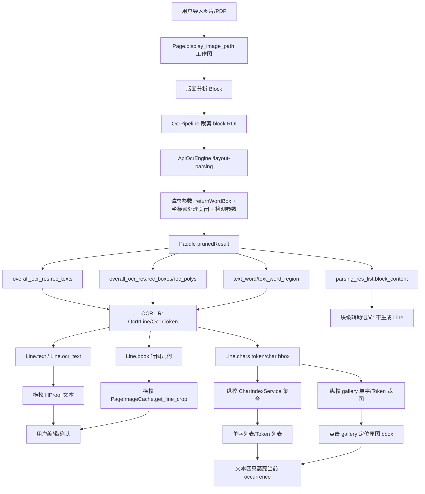

# OCR 逻辑链说明

本文档说明当前项目从 Paddle/API 请求到横校、纵校、集合和高亮的实际流转。目标是把“参数、字段、模型能力、项目处理链路”讲清楚，便于判断问题卡在哪一层。

## 1. 请求链

当前 API OCR 请求由 `app/engines/real_ocr_adapter.py::ApiOcrEngine._build_request_body()` 组装，实际发送到：

- `api_url + "/layout-parsing"`
- `Authorization: token <api_token>`
- `Content-Type: application/json`

当前实际调用的参数：

| 参数 | 当前值 | 层级 | 目的 |
| --- | --- | --- | --- |
| `file` | base64 图片 | 输入 | OCR 输入图 |
| `fileType` | `1` | 输入 | 图片类型 |
| `returnWordBox` | `true` | token/char | 要求返回 `text_word/text_word_region` |
| `useDocOrientationClassify` | `false` | 预处理 | 避免服务端旋转导致坐标漂移 |
| `useDocUnwarping` | `false` | 预处理 | 避免扭曲校正后坐标空间变化 |
| `useTextlineOrientation` | `false` | 行级 | 当前按原图坐标处理，不额外做行方向变换 |
| `textDetLimitSideLen` | `1536` | 检测 | 减少论文密集页被默认 960 下采样损伤 |
| `textDetBoxThresh` | `0.6` | 检测 | 提高检测框质量门槛，减少弱框/空框进入后链路 |
| `textDetUnclipRatio` | `1.3` | 检测 | 收紧检测框扩张，降低相邻字被包进同一框的概率 |

文档里提到但当前没有调用的参数：

- `textDetLimitType`
- `textDetThresh`
- `textRecScoreThresh`
- `visualize`
- `logId`
- PP-StructureV3 的 `useSealRecognition/useTableRecognition/useFormulaRecognition/useChartRecognition/useRegionDetection`
- layout 相关的 `layoutThreshold/layoutNms/layoutUnclipRatio/layoutMergeBboxesMode`
- markdown/export 相关参数，如 `outputFormats/prettifyMarkdown/markdownIgnoreLabels`

当前没有调用这些参数的原因是：本轮只收口 OCR proof 主链，避免继续扩大模型/输出面；其中 layout、markdown、表格、公式识别属于块级结构或导出层，不应直接影响行级 `Line` 与纵校 token。

## 2. 响应链

当前项目重点读取 `result.layoutParsingResults[]` 和 `result.ocrResults[]` 下的 `prunedResult`。

| Paddle 字段 | 官方语义 | 项目流向 | 当前适配状态 |
| --- | --- | --- | --- |
| `overall_ocr_res.rec_texts` | 行级 OCR 文本 | `Line.text` / `Line.ocr_text` | 已适配，行级主链 |
| `overall_ocr_res.rec_scores` | 行级置信度 | `Line.confidence` / 自动疑点 | 已适配 |
| `overall_ocr_res.rec_boxes` | 行级 bbox | `Line.bbox` | 已适配 |
| `overall_ocr_res.rec_polys/rec_polygons/dt_polys` | 行级 polygon/bbox | `Line.bbox` | 已兼容 |
| `text_word` | token/字文本 | `Line.chars[*].token_text` | 已适配 |
| `text_word_region` | token/字坐标 | `Line.chars[*].bbox` | 已适配 |
| `parsing_res_list.block_content` | 块级结构文本 | 仅作为块级辅助语义 | 不升成 `Line` |
| `parsing_res_list.block_bbox/block_label` | 块级结构框/标签 | 版面结构层 | 不作为行级 bbox |
| `markdown.text` | 文档级/块级输出 | 当前 proof 主链不消费 | 未接入 proof |

核心标准：

- 块级：`parsing_res_list.block_content`
- 行级：`overall_ocr_res.rec_texts + rec_boxes/rec_polys`
- token/char 级：`text_word + text_word_region`
- proof 集合：基于 `Line.text + Line.chars`，但只索引有可靠几何的行

## 3. OCR_IR 链

本轮新增 `app/core/ocr_ir.py`，把 Paddle raw JSON 和项目模型之间的语义显式拆开。它不是新的持久化模型，而是 OCR adapter 内部的中间表示，避免后续继续在 `rec_texts`、`text_word`、`Line`、纵校集合之间来回猜。

| 层级 | 对象 | 来源 | 作用 |
| --- | --- | --- | --- |
| Paddle raw | `overall_ocr_res.rec_texts/rec_boxes/rec_polys` | API 原始响应 | 行级主链 |
| Paddle raw | `text_word/text_word_region` | API 原始响应 | token/char 几何与 fallback 文本 |
| OCR_IR token | `OcrIrToken` | 单个 `text_word + region` | 保存 token 文本、bbox、kind、raw region |
| OCR_IR line | `OcrIrLine` | rec row 或 token row fallback | 保存 line 文本、bbox、source、review flags、tokens |
| 项目模型 | `Line/Char` | OCR_IR 转换 | 横校、纵校、导出消费的统一数据 |
| proof 集合 | `CharIndexService` | `Line.chars` | 再按字符、数字 token、公式 token 生成集合 |

映射规则：

1. 有 `rec_texts` 时，仍以 `rec_texts + rec_boxes/rec_polys` 生成 `OcrIrLine`，这符合行级主链标准。
2. `text_word/text_word_region` 只生成 `OcrIrToken`，通过 bbox overlap 挂到对应 `OcrIrLine`。
3. 如果行级 `rec_texts` 完全缺失，但 `text_word` 有可靠文本和 bbox，则生成 `OcrIrLine(source_text="text_word")`，并标记 `ir_token_text_fallback`。这是为“Paddle JSON 有文本但项目丢文本”的场景保底。
4. 如果已有 `rec_texts`，未匹配的 token row 不再额外升成新行，避免把错配/噪声 token 变成重复 OCR 文本。
5. OCR_IR 转 `Line` 后，横校只看 `Line.text + Line.bbox`，纵校只看 `Line.chars[*]`，集合/排序/高亮只看 `CharIndexService` 输出。

## 4. 处理链图

## 5. 公式 / 数字 / 普通文本策略

纵校集合不再把所有字符都等价处理：

| 类型 | 判定 | 集合 key | bbox 策略 | 排序 |
| --- | --- | --- | --- | --- |
| 普通中文/正文 | CJK 或普通文字 | 单字，或可靠 word token | 单字 bbox / word bbox | 普通文字区 |
| 连续数字 | `isdigit()` 连续 run | 整体数字，如 `2026` | 合并整段 bbox | 数字区，短到长 |
| 公式 token | 非 CJK，含拉丁/希腊/数学符号，如 `A+B`、`x1` | 整体公式 | 合并整段 bbox | 数字下面 |
| 标点/符号 | 纯标点/纯符号 | 一般不抢主题 | 仅在独立可靠时进入 | 符号区 |

公式按整体走的原因：用户反馈的“公式字母边角料小图”来自把 `A+B` 这类公式片段拆成单个字母/符号后再裁图，单个 bbox 很容易只剩边缘或和相邻符号互相串框。公式与数字一样，本质上更适合作为不可拆 token 校对：用户需要确认的是整个变量/表达式片段，而不是把每个公式字母混入正文单字集合。

当前实现位置：

- `app/core/ocr_ir.py::is_formula_token/is_formula_char` 定义公式 token 语义。
- `CharIndexService._iter_index_units()` 把连续公式 run 合成一个 token。
- `_sort_key()` 把公式 token 排到数字 token 之后，普通标点/符号之前。

## 6. Label Studio 参考结论

已参考 Label Studio 的官方导出说明和 OCR 标注格式思路。关键点：

- Label Studio 把一个标注拆成 **region** 与 **result**，同一个 region ID 关联 bbox、label、textarea 等结果；这给当前项目的启发是：不要把“几何框”“文本”“标签/类型”“消费状态”混成一个临时字段，应先进入 OCR_IR，再投射到不同 proof 消费层。
- Label Studio 图像导出的 bbox 使用相对百分比，并要求明确单位转换；当前项目不照搬百分比坐标，因为 Paddle API 在关闭 unwarping 时返回的是输入图像像素坐标，项目内部继续保持像素坐标更直接。
- Label Studio 的 prediction/annotation 思路适合借鉴：机器预测先作为可追踪中间结果，人工结果再作为终审。当前 OCR_IR 也是“机器 raw → 中间表示 → proof 人工消费”的链路，不让 UI 直接消费 raw JSON。
- 不适合照搬的点：Label Studio 是通用标注平台，region/result JSON 很灵活但较重；当前桌面 OCR 工具需要轻量、可构建、与现有 `Line/Char` 模型兼容，因此只借鉴“region/result 分离”和“ID/来源可追踪”的思想，不引入完整 Label Studio 标注格式。

## 7. 适配现状

已经适配：

- API 请求 `returnWordBox=true`
- 行级文本、置信度、行框读取
- token/word bbox 读取
- OCR_IR：`OcrIrLine/OcrIrToken` 中间层
- `rec_texts` 完全缺失时，可由可靠 `text_word` fallback 保住文本并标记 `ir_token_text_fallback`
- token row 与行 bbox 按 overlap 对齐，不再默认按数组下标绑定
- bbox 空窄/无墨迹过滤
- 连续数字 token 合组
- 公式 token 合组，并在纵校集合中排在数字下面
- 多字符 word bbox 不伪装成精确单字框
- 无可靠行几何时保留 OCR 文本，但标记 `missing_line_bbox`，不进入纵校字符索引
- proof 消费层对同页重叠重复行去重，避免横校/纵校重复展示和重复索引
- 纵校文本区只高亮当前选中的 occurrence，不再把全文同类字全部刷蓝

尚未适配：

- `parsing_res_list.block_content` 的正式块级展示/导出承载字段
- `markdown.text` 的文档级预览/导出链
- 表格、公式、印章、图表等结构化识别输出的专门 proof 面板
- 无几何 OCR 文本的专门队列；当前只保留文本并标记疑点
- 基于真实模型输出的自动参数寻优

## 8. 本轮判断

用户反馈的残留现象主要卡在三段：

1. **重复出现**：同一 OCR 行可能以重叠 block/line 的形式进入 proof 消费层，横校、纵校文本、CharIndex 都会重复消费。本轮在 proof line 迭代层统一去重。
2. **集合仍混相邻字**：一部分来自 Paddle token bbox 本身过松，一部分来自 fallback/重复行污染。本轮收紧 `textDetUnclipRatio=1.3`，并继续跳过无可靠几何行的纵校索引。
3. **公式字母边角料**：公式片段此前被当成普通单字进入集合，单个字母/符号 crop 容易变成边角料。本轮把公式 run 当成 token，和数字一样整体裁图、整体排序。
4. **OCR 文本缺失**：如果 `rec_texts` 没有行级文本，但 `text_word` 已经有文本与 bbox，旧链路不会产出 `Line`。本轮通过 OCR_IR token fallback 保住这类文本，并打疑点标记。

仍需后续轮次处理的问题：

- 如果 Paddle 本身把一整行切成多个单字级 `rec_texts`，仅靠 proof 消费层无法无损合并，需要在 OCR adapter 增加“同基线行合并”策略，并用真实响应回归。
- 无几何 OCR 文本当前能保住文本，但无法提供可靠行图/单字图；后续应设计“无几何文本队列”或让用户手工绑定行框。
- 公式 token 当前基于字符类别和连续 run 判定，还没有结合版面 `EQUATION` block 或公式 OCR 专用输出；后续可在 OCR_IR 上加入 block/type 上下文进一步降误判。
