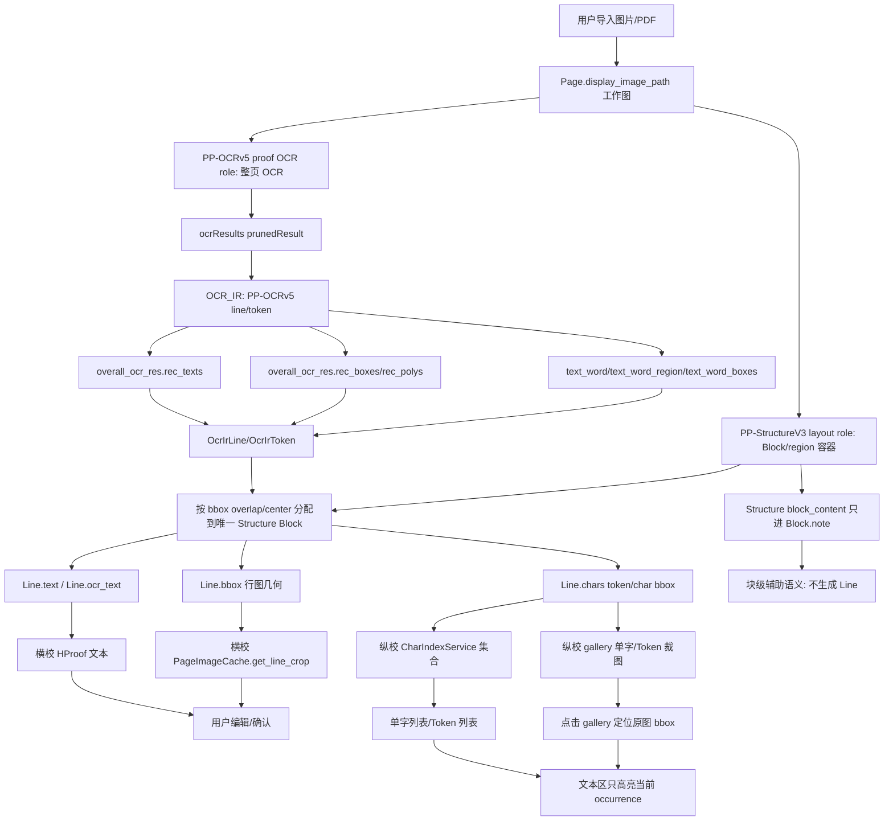

# OCR 逻辑链说明

本文档说明当前项目从 Paddle/API 请求到横校、纵校、集合和高亮的实际流转。目标是把“参数、字段、模型能力、项目处理链路”讲清楚，便于判断问题卡在哪一层。

## 1. 请求链

当前主程序 API 请求按“角色”解析端点，而不是让同一个模型同时承担版面和 proof。端点由 `app/core/api_profiles.py::resolve_api_endpoint_for_role()` 统一解析：

- **layout role**：使用 `PP-StructureV3` / VL 的 `/layout-parsing`，只产生 layout/block/region 容器；
- **proof OCR role**：使用 `PP-OCRv5` 的 `/ocr`，统一产生 HProof line text/geometry 与 VProof char/token geometry；
- 官方 AiStudio 预设的 Structure/VL URL 在 OCR 阶段会切到 PP-OCRv5 官方 `/ocr`；PP-OCRv5 URL 在版面阶段会切到 PP-StructureV3 官方 `/layout-parsing`；
- `profile` 不是死参数：当用户保存的是官方 profile 的 root URL（去掉 `/ocr` 或 `/layout-parsing` 后的地址）时，resolver 会结合 profile 找到对应的官方成对端点；自定义 root 不会被误切到官方 host。
- 自部署服务若保存的是根地址，则 layout 补 `/layout-parsing`、OCR 补 `/ocr`；若保存的是完整 `/layout-parsing`，OCR 阶段会在同一 root 下替换为 `/ocr`。
- `Authorization: token <api_token>`
- `Content-Type: application/json`

当前请求参数已经按模型 family 分流，不再四个模型套同一份 payload：

| profile | endpoint | request family | 会传的参数 | 不传/降级的参数 | 当前最大可信文本几何 |
| --- | --- | --- | --- | --- | --- |
| `pp-ocrv5` | `/ocr` | `ocr-word-box` | `returnWordBox`、坐标稳定开关、OCR 检测/识别阈值 | layout/VL/markdown 专用参数 | `word`；单字 token 才可信为 `char` |
| `pp-structurev3` | `/layout-parsing` | `ocr-word-box` | `returnWordBox`、坐标稳定开关、OCR 检测/识别阈值 | VL 专用理解参数；表格/公式/印章开关暂未开启 | `word`；单字 token 才可信为 `char`，另有 layout/block |
| `paddleocr-vl` | `/layout-parsing` | `vl-layout` | `file/fileType`、坐标稳定开关 | `returnWordBox`、OCR det/rec 阈值、unclip 等传统 OCR 参数 | `line`/block；不承诺 word/char |
| `paddleocr-vl-1.5` | `/layout-parsing` | `vl-layout` | `file/fileType`、坐标稳定开关 | `returnWordBox`、OCR det/rec 阈值、unclip 等传统 OCR 参数 | `line`/block；不承诺 word/char |

`ocr-word-box` family 当前实际调用的参数；其中三个坐标稳定开关也会发给 VL family，因为它们控制服务端预处理坐标空间，不属于传统 OCR detector/recognizer 参数：

| 参数 | 当前值 | 层级 | 目的 |
| --- | --- | --- | --- |
| `file` | base64 图片 | 输入 | OCR 输入图 |
| `fileType` | `1` | 输入 | 图片类型 |
| `returnWordBox` | `true` | token/word | 要求返回 `text_word/text_word_region`；返回的是 token/word，不天然等于真实 char |
| `useDocOrientationClassify` | `false` | 预处理 | 避免服务端旋转导致坐标漂移 |
| `useDocUnwarping` | `false` | 预处理 | 避免扭曲校正后坐标空间变化 |
| `useTextlineOrientation` | `false` | 行级 | 当前按原图坐标处理，不额外做行方向变换 |
| `textDetLimitSideLen` | `1536` | 检测 | 减少论文密集页被默认 960 下采样损伤 |
| `textDetLimitType` | `max` | 检测 | 仍按最长边限制，不改成 `min`，避免大页被放大到不可控尺寸 |
| `textDetThresh` | `0.3` | 检测 | 使用 Paddle 默认文字区域阈值，不额外抬高召回门槛 |
| `textDetBoxThresh` | `0.6` | 检测 | 提高检测框质量门槛，减少弱框/空框进入后链路 |
| `textDetUnclipRatio` | `2.0` | 检测 | 恢复 Paddle 默认框扩张语义；上一轮过低的 1.3 可能制造“边角料”式紧框 |
| `textRecScoreThresh` | `0.0` | 识别 | 不在服务端丢弃低分文本，低置信交给 proof/疑点队列处理 |

文档里提到但当前没有调用或只在部分模型调用的参数：

- `visualize`
- `logId`
- PP-StructureV3 的 `useSealRecognition/useTableRecognition/useFormulaRecognition/useChartRecognition/useRegionDetection`
- layout 相关的 `layoutThreshold/layoutNms/layoutUnclipRatio/layoutMergeBboxesMode`
- markdown/export 相关参数，如 `outputFormats/prettifyMarkdown/markdownIgnoreLabels`
- VL 模型不再发送 `returnWordBox/textDet*/textRec*`，因为这些传统 OCR detector/recognizer 参数对 VL layout endpoint 不一定生效，甚至可能被忽略或拒绝；但仍关闭 orientation/unwarping/textline orientation，避免版面坐标落到服务端变换后的画布。

当前没有调用这些参数的原因是：本轮只收口 OCR proof 主链和四模型能力分流，避免继续扩大模型/输出面；其中 layout、markdown、表格、公式识别属于块级结构或导出层，不应直接影响行级 `Line` 与纵校 token。

本轮重新看 PaddleOCR/PaddleX 参数后，结论是：继续靠事后几何规则修偏不是主方向。坐标可靠性首先取决于两件事：

1. 服务端不能改变输入图坐标空间，所以三个预处理开关继续关闭。
2. 对 OCR family，检测框不能被人为压得过紧，所以 `textDetUnclipRatio` 从 1.3 回到 Paddle 文档默认 2.0；过紧框会让 token/word bbox 只覆盖笔画边缘，后续 proof 再怎么裁都会像“邻字/边角料”。
3. 对 VL family，不把传统 OCR 参数硬塞进去，但坐标稳定开关仍要保留。VL 的价值在 layout/markdown/语义结构，若需要 word/char 几何，应和 PP-OCRv5/Structure 组成双模型链，而不是让 VL 假装能返回字框。

## 2. 响应链

当前项目重点读取 `result.layoutParsingResults[]` 和 `result.ocrResults[]` 下的 `prunedResult`。

| Paddle 字段 | 官方语义 | 项目流向 | 当前适配状态 |
| --- | --- | --- | --- |
| `overall_ocr_res.rec_texts` | 行级 OCR 文本 | `Line.text` / `Line.ocr_text` | 已适配，行级主链 |
| `overall_ocr_res.rec_scores` | 行级置信度 | `Line.confidence` / 自动疑点 | 已适配 |
| `overall_ocr_res.rec_boxes` | 行级 bbox | `Line.bbox` | 已适配 |
| `overall_ocr_res.rec_polys/rec_polygons/dt_polys` | 行级 polygon/bbox | `Line.bbox` | 已兼容 |
| `text_word` | token/字文本 | `Line.chars[*].token_text` | 已适配 |
| `text_word_region` / `text_word_boxes` | token/字坐标；Paddle 内部先生成 region，JSON 常导出 boxes | `Line.chars[*].bbox` | 已适配，二者等价进入 Inspector token bbox 链 |
| `parsing_res_list.block_content` | 块级结构文本 | 仅作为 block note / 版面辅助语义 | 不升成 `Line`，不进入 HProof/VProof 主链 |
| `parsing_res_list.block_bbox/block_label` | 块级结构框/标签 | Structure layout 容器 | 只作为 PP-OCRv5 line 的空间归属容器，不作为行级 bbox |
| `markdown.text` | 文档级/块级输出 | 当前 proof 主链不消费 | 未接入 proof |

核心标准：

- 块级：`PP-StructureV3 parsing_res_list/layout_det_res`
- 行级：`PP-OCRv5 overall_ocr_res.rec_texts + rec_boxes/rec_polys`
- token/word 级：`PP-OCRv5 text_word + text_word_region/text_word_boxes`
- proof 集合：基于 `Line.text + Line.chars`，但只索引有可靠几何的行

Inspector 侧也必须保持同一层级语义：`run_ocr.py` 的 API / 本地 Paddle / 本地 Structure flatten 现在会保留 `prunedResult.text_word` 与 `text_word_region/text_word_boxes` 顶层字段，不再只合并 `overall_ocr_res`。`PaddleAdapter` 同时读取 `prunedResult`、flatten 后顶层、`overall_ocr_res` 三个位置，并兼容 `textWord/textWordRegion/textWordBoxes` camelCase 别名。因此 `chars` 是否回显现在取决于响应里是否真的有 token/word region/boxes，而不是 flatten/parser 把字段丢掉。

本轮源码审计确认了一个易错点：PaddleX OCR pipeline 内部变量名是 `text_word_region`，但 `paddlex/inference/pipelines/ocr/result.py::OCRResult._to_json()` 对外 JSON 常写成 `text_word_boxes`。如果只盯 `text_word_region`，本地 Paddle 已经算出的 token 框会在 Inspector flatten/parser 层被误判为缺失。

已读取并用于判断的 PaddleOCR/PaddleX 源码点：

- `paddleocr/_pipelines/ocr.py::PaddleOCR.__init__` 与参数映射：`return_word_box` 会下发到 `SubModules.TextRecognition.return_word_box`，CLI 参数名为 `--return_word_box`。
- `paddlex/inference/serving/basic_serving/_pipeline_apps/ocr.py`：服务 API 将请求里的 `returnWordBox` 传给 `pipeline.infer(... return_word_box=...)`。
- `paddlex/inference/pipelines/ocr/pipeline.py`：`return_word_box=True` 时初始化 `text_word/text_word_region`，识别后调用 `cal_ocr_word_box()` 生成 token box，并再生成 `text_word_boxes`。
- `paddlex/inference/models/text_recognition/predictor.py` 与 `processors.py`：识别后处理返回 `word_list/word_col_list/state_list`；transformers engine 路径提示不支持 `return_word_box`。
- `paddlex/inference/pipelines/components/common/cal_ocr_word_box.py`：中文 `state == "cn"` 时按字符生成 char-ish box，多字符 token 仍可能是共享 word box。
- `paddlex/inference/pipelines/ocr/result.py::_to_json()`：对外 JSON 包含 `text_word_boxes/text_word`，这就是 Inspector 需要兼容 boxes alias 的直接原因。

## 3. 坐标转换链

当前统一按“输入图像像素空间”理解 Paddle 坐标：

1. **版面分析输入**：`Page.display_image_path` 对应的整页工作图。
2. **OCR 输入**：`OcrPipeline` 从整页工作图裁出的 block crop。
3. **Paddle 返回坐标**：在关闭 orientation/unwarping/textline orientation 后，坐标应落在“本次上传给 Paddle 的图像”上。版面阶段是 page-space；OCR 阶段是 crop-space。
4. **解析阶段**：`_bbox_from_region()` 支持 xyxy、四点 polygon、flat 8 数字 polygon、嵌套 polygon、dict alias，并按当前输入图尺寸 clamp。flat polygon 不能按前四个数当 xyxy，否则会把四边形误读成一条线。
5. **回写阶段**：`OcrPipeline` 只在 OCR 阶段把 crop-space line/char bbox 通过 crop seam 转成 page-space。proof 层不再猜 Paddle 坐标空间。
6. **画布/裁图阶段**：ImageViewer、横校 line crop、纵校 char crop 只消费 page-space bbox。

版面 API 另有一条 metadata 校验：如果响应带 `result.dataInfo.width/height`，优先用它判断 API 坐标画布；但若 raw bbox 已经明显超过该 metadata 画布、同时仍落在当前页面范围内，则判定 metadata 与 bbox 坐标空间矛盾，保持 `1.0` 不二次缩放。`input_img_shape/doc_preprocessor_res` 也走同一冲突保护，避免旧服务/不同模型返回冲突 metadata 时把 page-space 框再次放大造成偏移。只有 metadata 缺失或不矛盾时才退回 bbox 最大坐标启发式，这样也避免把“页面上本来没有靠右/靠下元素”误判成缩放。

## 4. OCR_IR 链

本轮新增 `app/core/ocr_ir.py`，把 Paddle raw JSON 和项目模型之间的语义显式拆开。它不是新的持久化模型，而是 OCR adapter 内部的中间表示，避免后续继续在 `rec_texts`、`text_word`、`Line`、纵校集合之间来回猜。

| 层级 | 对象 | 来源 | 作用 |
| --- | --- | --- | --- |
| Paddle raw | `overall_ocr_res.rec_texts/rec_boxes/rec_polys` | API 原始响应 | 行级主链 |
| Paddle raw | `text_word/text_word_region` | API 原始响应 | token/char 几何与 fallback 文本 |
| OCR_IR token | `OcrIrToken` | 单个 `text_word + region` | 保存 token 文本、bbox、kind、raw region |
| OCR_IR line | `OcrIrLine` | rec row 或 token row fallback | 保存 line 文本、bbox、source、review flags、tokens |
| 项目模型 | `Line/Char` | OCR_IR 转换 | 横校、纵校、导出消费的统一数据 |
| proof 集合 | `CharIndexService` | `Line.chars` | 再按字符、数字 token、公式 token 生成集合 |

映射规则：

1. 有 `rec_texts` 时，仍以 `rec_texts + rec_boxes/rec_polys` 生成 `OcrIrLine`，这符合行级主链标准。
2. `text_word/text_word_region` 只生成 `OcrIrToken`，通过 bbox overlap 挂到对应 `OcrIrLine`。
3. 如果行级 `rec_texts` 完全缺失，但 `text_word` 有可靠文本和 bbox，则生成 `OcrIrLine(source_text="text_word")`，并标记 `ir_token_text_fallback`。这是为“Paddle JSON 有文本但项目丢文本”的场景保底。
4. 如果已有 `rec_texts`，未匹配的 token row 不再额外升成新行，避免把错配/噪声 token 变成重复 OCR 文本。
5. OCR_IR 转 `Line` 后，横校只看 `Line.text + Line.bbox`，纵校只看 `Line.chars[*]`，集合/排序/高亮只看 `CharIndexService` 输出。

## 4.1 主程序双模型 Proof 归属链

本轮主程序已经把职责边界落到代码：

1. `LayoutAnalyzer` 解析 layout role endpoint，只把 `PP-StructureV3` 的 `layout_det_res/parsing_res_list` 变成 `Block`；`block_content` 只进入 `Block.note` 预览，不会生成 `Line`。
2. `ApiOcrEngine.prefer_page_ocr=True`，因此 `OcrPipeline` 在 API proof 阶段不再逐个 Structure block 调 `/layout-parsing`；它改为对整页调用 proof OCR role，也就是 `PP-OCRv5 /ocr`。
3. `PP-OCRv5` 返回的 `Line` 先保留自己的行框、文本、token/char bbox，再由 `OcrPipeline._assign_page_ocr_lines_to_blocks()` 按空间关系归属到 Structure block。
4. 可承接 PP-OCRv5 行的容器包括 `TEXT/TITLE/REFERENCE/EQUATION/FIGURE_CAPTION/TABLE_CAPTION`；`FIGURE/TABLE/UNKNOWN` 仍不吃 proof line。这样页级 OCR 路径不会先清空 caption/equation 的旧行又无法回填。
5. 归属裁决以“line bbox 被 block 覆盖的比例”为主；若比例不足但 line 中心落入 block，也允许作为弱匹配；多个 block 同时匹配时选择覆盖更好、面积更小、阅读顺序更靠前的容器。
6. 每条 PP-OCRv5 line 只分配一次，所以不会因为多个 Structure block 重叠而在横校重复；没有命中任何可承接容器的 line 会放入一个 synthetic `TEXT` block，`note=PP-OCRv5 unmatched proof lines`，保证 proof 不丢行但也不冒充 Structure 输出。
6. `ProofCropService` 仍可对 PP-OCRv5 line/char 做图像内容驱动的收紧与缺项 fallback，但 `bbox_source=ocr`、`bbox_granularity=char/word` 的显式 OCR box 不会被覆盖成估算框。

这样 HProof 的 `Line.text/Line.bbox` 与 VProof 的 `Line.chars[*].bbox/token_text` 均来自 PP-OCRv5；Structure 只决定这些 line 挂在哪个版面容器下。

## 5. 处理链图



## 6. 参数与元素限制

当前能稳定拿到的元素：

| 模型/端点 | 当前能拿到 | 当前用途 | truthful granularity |
| --- | --- | --- | --- |
| PP-OCRv5 `/ocr` | `ocrResults[].overall_ocr_res.rec_texts/rec_boxes/rec_polys`，可选 `text_word/text_word_region/text_word_boxes` | HProof line 主链、VProof char/token 主链；未命中 layout 的行进入 synthetic text block | 无 word boxes 时仅 line；多字 token 是 `word`，单字 token 才是 `char` |
| PP-StructureV3 `/layout-parsing` | `layout_det_res.boxes`、`parsing_res_list.block_*`、`markdown`、可能带 `overall_ocr_res` | layout/block/region/table/formula 容器，block text 仅作 note 预览 | 不作为 HProof line / VProof char 主来源 |
| PaddleOCR-VL `/layout-parsing` | layout/markdown/结构化解析，schema 与 Structure 接近但更偏文档理解 | 版面/结构候选，后续可用于公式、图表、复杂版面 | 当前按 line/block 消费，不伪造 word/char |
| PaddleOCR-VL-1.5 `/layout-parsing` | 与 VL 类似，偏文档理解和结构输出 | 版面/结构候选 | 当前按 line/block 消费，不伪造 word/char |

当前还拿不到或未正式消费的元素：

- 公式专用结构：已有 `formula/equation` 标签映射，但 proof 还没有公式面板；现在只在纵校集合层把公式 run 当 token。
- markdown 文档级输出：能从响应里看到，但 proof 主链不消费，避免 markdown 与行级 OCR 混层。
- 表格结构、印章、图表：版面可识别为 block，但没有专门校对/导出链。
- 每个字符的“真实置信度”：Paddle word box 主要提供位置，当前字符置信度仍继承行级分数。
- 真正逐字 bbox：只有当 `text_word` 中 token 本身长度为 1 且有对应 `text_word_region`，才标为 `bbox_granularity=char`；多字 token 共享框只标 `word`；没有 token region 时标 `fallback/unavailable`。

这些限制分别卡在：

1. **模型/端点层**：PP-OCRv5 没有 layout block；Structure/VL 有结构但不再被当作 proof 文本/字框真值。
2. **OCR_IR 层**：已经能区分 raw/line/token，并由 `OcrPipeline` 把 PP-OCRv5 line 显式归属到 layout block。
3. **proof UI 层**：横校/纵校目前围绕 `Line/Char`，还没有表格/公式/markdown 专门视图。

## 7. truthful char/token 坐标链

这轮的重点不是“把所有字符都补出一个 bbox”，而是让字段名和实际精度一致：

| 原始条件 | Inspector IR | 主程序 `Line.chars` | proof 消费语义 |
| --- | --- | --- | --- |
| 有单字 `text_word_region` | `bbox_source=ocr`、`bbox_granularity=char` | 同样标 `ocr/char` | 可以当单字 crop 使用 |
| 有多字 token/word region | 每个字符引用同一 bbox，但 `bbox_granularity=word`、`collection_kind=token` | 同样标 `ocr/word`、`token_text=整词` | 不再伪装成多个精确单字，优先走 token 集合 |
| 只有 line bbox | Inspector 的 char bbox 保持 `None`，`bbox_source=unavailable` | 主程序可为内部可用性补 fallback bbox，但标 `fallback` | 默认不进入纵校单字 gallery；只能在显式兼容/诊断模式下查看 |
| 没有 line bbox 但有 token row | 只在 token 文本完整匹配时作为 fallback line | 标 `ir_token_text_fallback` | 明确是文本保底，不是模型 line 输出 |

当前为什么以前会出现“chars 其实是 fallback”：Inspector 先按 `line_bbox` 给每个 glyph 填一个 bbox，再在有 word region 时覆盖局部字符；没有 word region 的字符看起来也有框，但那只是整行框。现在 Inspector 不再这样做：line-only 字符的 bbox 是 `None/unavailable`，word 级共享框也只标 `word/token`。主程序 proof 层为了 UI 裁图仍允许 fallback bbox，但字段上保留 `bbox_source=fallback` 和 `bbox_granularity=fallback`，不会冒充 `ocr/char`。

主程序纵校默认只索引真实 OCR 几何：`CharIndexService()` 会过滤 `bbox_source!=ocr` 或 `bbox_granularity=fallback/unavailable/line` 的单位。旧项目/旧测试若确实需要查看估算结果，必须显式使用 `CharIndexService(include_fallback=True)`，这让 fallback 从默认主展示中降级为兼容/诊断入口。VProof 左侧列表也会标出 `[char]` / `[token]`，tooltip 显示 `bbox_source/bbox_granularity`，避免用户把 token 图或 fallback 图误认为精确单字图。

## 7.1 连通域与 Paddle token 对应分析

本轮只做主程序方向的真实样张实验，不把连通域结果伪装成最终功能。实验样张仍用整页 `/mnt/d/project/ocr_process/file/244771纵校/120166.tif`，持久证据保存在 `paddle-char-box-samples/component-matching/`：`120166_component_matching_summary.json` 是可复核统计，`120166_hanzi_token_component_grid.png` 是 101 个汉字 token 切图拼图，`120166_hanzi_token_component_grid_preview.png` 是前 30 个快速预览，`120166_line_component_counts_overlay.png` 是整页 line 级 cc/text_len 叠图，`120166_line_bbox_component_grid.png` 是只用 line bbox 输入时的错误/不安全示例，`120166_source_comparison_card.png` 是两种输入源对比卡片，`120166_normal_shape_filter_card.png` / `120166_normal_shape_filter_grid.png` 是“正常字区间”过滤前后对比。实验方法是在每条 PP-OCRv5 行框内做 Otsu 反色二值化，再分别用无形态学、`3x2`、`5x3`、`7x3` 等小核闭运算跑 connected components，按 x 坐标排序后和整页 OCR 文本/token 顺序对照。

关键实测结论：

- 整页 37 行里，连通域数等于整行文本长度的行数很少：无形态学 `3/37`，`3x2` 为 `3/37`，`5x3` 为 `2/37`，`7x3` 为 `12/37`。`7x3` 看起来更接近行长，但它是通过粘连换来的，平均偏差只有 `-0.3514` 不代表逐字对应可靠。
- 整页平均偏差说明“整行连通域 = 字符数”不稳定：无形态学平均比行长多 `13.1081` 个域，`3x2` 多 `6.8108`，`5x3` 多 `1.2432`，`7x3` 少 `0.3514`；单行偏差范围分别到 `0~40`、`-2~19`、`-8~7`、`-10~5`。
- Paddle token 侧更关键：整页 `text_word/text_word_boxes` 共 37 行、998 个 token，其中 874 个是单字 CJK token，124 个是数字/拉丁/公式/标点/混合 token；本页没有多字纯 CJK token。这意味着当前样张的正文汉字主路径已经由 Paddle 给到单字 token，连通域不应该再整行重切，只适合做 bbox 内墨迹收紧/异常诊断。
- 典型密集正文行仍显示风险：`时,2016年增值税分成改革导致的原营业税分成比例下降,进一步弱化了地方政府` 长 38，CJK 32、数字 4、标点 2；连通域为 raw `48`、`3x2=44`、`5x3=36`、`7x3=36`。它不再稳定等于字符数，原因包括标点/数字小块、个别汉字断成多个部件、局部闭运算又会把相邻字粘在一起。
- 公式/拉丁行更不适合拆：`Y=α+βIncentive,×Post2+γXc+δ+φ{+εa` 长 33，拉丁/符号占主体，连通域 raw `36`、`3x2=31`、`5x3=26`、`7x3=23`；任何核都不能给出稳定逐字符语义。
- 可视化拼图显示：token 文本与字图主体大体能对上，但单字 token 内的连通域数不总是 1。例如 `量/增/综/合/品/心` 会因为框内旁边碎片或汉字内部断裂出现 `cc>1`；`一/二/三` 这类低高度横画在当前 `min_height=8` 过滤下可能出现 `cc=0`。所以 `cc` 是诊断信号，不是替代 PP-OCRv5 token 文本的真值。
- 输入源对比结论：`char/token bbox` 输入能把裁剪窗口先限制在 PP-OCRv5 token 内，图文主体可直接核对；`line bbox` 输入只能拿整行连通域再按顺序猜字符，`3x2` 下只有 `3/37` 行等于全文长度、`0/37` 行等于 CJK 数，且会把数字、标点、公式符号、邻字碎片一起纳入排序。因此 line bbox 只适合 HProof 行图和诊断，不适合直接生成 VProof 单字绑定。
- “正常字区间”不能用绝对宽高，因为标题/正文/脚注字号不同。当前实验从 562 个 `单字 CJK token 且 cc=1` 的样本学习相对区间：`component_width / reference_height = 0.6682~0.8967`、`component_height / reference_height = 0.7217~0.9297`、`component_area / reference_height^2 = 0.1259~0.3687`、`aspect = 0.84~1.0723`。把该区间套回 line bbox 连通域后，组件从 `1334` 个降到 `376` 个，过滤掉 `958` 个笔画碎片、标点、数字/公式片段和异常宽块；但 accepted 数等于 CJK 数的行仍只有 `3/37`，说明形状过滤只能做 guardrail，不能让 line bbox 单独成为字图绑定源。
- line 连通域里“某些笔画被放大成一个元素”有两个原因：一是 line bbox 没有 token 边界，小标点、数字、公式符号、邻字碎片都会作为独立 component 进入排序；二是可视化拼图为了肉眼检查会把每个 component tile 自动放大，小笔画看起来像一个大元素。再叠加闭运算时相近笔画可能合并，所以 line 级 component 只能作为候选/异常提示，不能直接映射到 OCR 文本字符。

因此，当前不能把“整行连通域数 == 整行字符数”作为硬前提；可用的工程假设应更窄：

1. **单字 Paddle token 已经是最可信入口**：如果 PP-OCRv5 给出长度为 1 的 CJK token bbox，主程序只需要在该 bbox 内做墨迹收紧或邻字错位保护，不要用整行连通域重切它。
2. **多字中文 token 可做受限拆分候选，但本页未出现**：只有当后续真实响应出现纯 CJK 多字 token，且 token bbox 内的轻量连通域/投影段数量与 CJK 字数一致、段的 x 顺序单调、每段宽高接近当前行高、且段间距不异常时，才允许把 `ocr/word` 提升成候选 `ocr/char_refined`。否则继续保持 token 集合。
3. **数字、拉丁、公式和混合 token 不拆**：`2026` 这类 run 在不同核下会从 4 个域变成 1 个域，拆分稳定性低；公式/拉丁符号也有类似问题。它们继续走数字 token / 公式 token 集合，不进入普通单字集合。
4. **整行级只能做校验，不做最终分配**：连通域行级计数可用于诊断“这一行适不适合细拆”，但最终对应关系必须落在 Paddle token bbox 内，用 token 局部范围约束，避免行内前后串位。
5. **失败必须诚实降级**：如果局部连通域数、投影段、token 字符数三者不一致，或任一候选段越界/过窄/无墨迹，就保留 `bbox_granularity=word` 或 `fallback`，不要输出看似精确的 char crop。

后续若实现，应放在 proof 几何正规化链中，作为 `ocr/word` token 的可选 refine 阶段：输入 `Line`、`Char` token 元数据和整页图，输出带来源标记的候选子框。该阶段不能覆盖原始 Paddle bbox，应保留 `raw_token_bbox`、`refined_bbox`、`refine_status` 和失败原因，UI 可把它作为“自动细拆建议”，人工仍可回退到 token 图。

## 7.2 wordbox_anchor 规则消融结论

本轮继续沿 Claude/Codex 的 `wordbox_anchor` 路线做规则拆解，而不是另起一套算法。可复跑脚本为 `app/experiments/run_wordbox_anchor_ablation.py`，输入是持久化的 `paddle-char-box-samples/wordbox-anchor-ablation/120166_ppocrv5_return_word_box.json` 与 `file/244771纵校/120166.tif`。输出证据在 `paddle-char-box-samples/wordbox-anchor-ablation/`：

- `01_rule_on_off_samples.png`：同一 token 在 full/no ownership/no edge crumb/largest/no clip 下的切图对比；
- `02_success_failure_residual_samples.png`：full anchor 的成功与残留高风险样本；
- `03_rule_contribution_ranking.png`：规则贡献排序卡片；
- `04_ablation_report.txt`：统计报告；
- `wordbox_anchor_ablation_summary.json`：可复核统计与样本 token id。

当前真实材料的基础事实：`text_word` 能完整重建 `rec_texts`，token 类型为 `CJK=874`、`number=19`、`punct=86`、`latin=13`、`formula=6`。因此真实 `text_word_boxes` 主链应是：`zip(text_word, text_word_boxes)` 作为唯一顺序与几何锚点，Structure 继续只提供 layout 容器；line bbox 只作为 HProof 行图、ownership 上下文、行高参考和诊断，不再作为 VProof 单字真值。

消融统计显示，full anchor 在 874 个 CJK token 上把原始 `cc1=427 / cc2+=447` 收到 `cc1=803 / cc2+=71`，CJK 可绑定率为 `100%`。规则贡献按本页实测排序：

1. **edge crumb suppression**：贡献最大。关闭后 `cc2+` 从 full 的 `71` 升到 `228`，多出 `157` 个噪声多连通域；它压制的是 source bbox 边缘小而窄、贴边的邻字碎片。
2. **ownership intervals**：关闭后 `cc2+` 从 `71` 升到 `130`，多出 `59` 个邻字归属错误；它压制的是质心已经属于相邻 token 的 component。
3. **union multi-CC**：不能删。只取最大 component 会丢掉 `71` 个合法多笔画/分体汉字的部件，例如 `术/动/品/需/三/以` 这类 cc2+ 或 cc3 字。
4. **non-CJK split**：应保留为分流规则。它把 124 个 number/latin/formula/punct token 挡在 CJK glyph lane 之外；不分流时会出现 `fallback_source_box=13`，公式/标点/数字也会被 CJK 规则错误消费。
5. **source/ownership crop clamp**：本页贡献低，是 guardrail。`no_source_clip` 与 full 的 cc 和 outside 计数相同；在 120166 上不是决定性规则，但对更差 word box 仍可防止 crop 过界。
6. **quick_simple / realloc / white-margin**：偏性能和视觉白边优化。Claude v11 action log 中 `realloc` 和 `wm` 次数很高，但它们主要影响裁图留白与观感，不替代 ownership、edge crumb、union 的正确性作用；`stop-on-ink` 已被 v11 文档弃用，不应重新引入。

多笔画汉字最稳判据不是“只要 cc=1”，而是：先限定在 PP-OCRv5 source word box 内，再按 ownership/edge crumb 过滤，最后对同一 ownership 内保留的 components 做 union。`cc2+` 在中文里是正常形态，不应被当作错误；错误的是把邻字碎片或非 CJK token 混进来。

边角料最稳压制规则是两层：第一层按相邻 token 中点划 ownership，component 质心不在当前 ownership 内就丢；第二层丢掉贴 source 左右边的小面积窄 component。正常字区间/line 级形状过滤只能做 guardrail，不应作为主绑定规则。

数字 / 公式 / 混合数字行必须先靠 OCR 文本/token 分类分流：正文内 `2016` 之类数字 run 不单独建 Structure 框，也不从 line 连通域猜；在 VProof 集合层合并为 number token。公式/变量片段按 formula token/run 处理；独立公式可以由 Structure `EQUATION` 提供容器，但 proof text/bbox 仍由 PP-OCRv5 line/token 主链负责。

## 7.3 PP-OCRv5 bbox 质量分级与辐射区参数 profile

后续调参不能再使用“全局改一个参数”的方式。`wordbox_anchor` 的主要风险不是某个参数绝对好坏，而是不同质量的 PP-OCRv5 `text_word_boxes` 需要不同处理强度：紧框、松框、左偏旁被裁、右侧邻字蹭入、细横字、非 CJK token 的风险完全不同。如果把某个 Q2 风险样本调好后全局应用，很容易把原本 Q0 稳定字带坏。

本轮新增辐射区作用域可视化脚本：

```bash
python app/experiments/run_radiation_zone_comparison.py
```

输出在 `paddle-char-box-samples/radiation-zone-comparison/`：

- `01_radiation_scope_current_vs_adjusted.png`：首个页面的当前 v11 与调整后辐射区横向对比，列为“当前作用域 / 当前成品字 / 调整后作用域 / 调整后成品字”。
- `02_bbox_quality_tier_matrix.png`：bbox 质量分级与允许调参范围。
- `03_radiation_scope_report.txt`：首个页面的参数敏感 token 列表与解释。
- `04_page_scope_overview.png`：按页统计的参数敏感概览。
- `05_page_scope_batch_report.txt`：20 页批量统计报告。
- `pages/*_radiation_scope_current_vs_adjusted.png`：每页独立的横向作用域与成品字样例图。
- `radiation_zone_comparison_summary.json`：可复核的 bbox、zone、component label 与页级统计。

颜色语义必须固定，避免误读：

- **深绿色**：主题 keep seed，component 与该区相交或贴边才直接保留。
- **浅绿色**：左侧 extension candidate，只能走弱救回条件，不能直接保留独立碎片。
- **红色**：弱/反辐射边缘区，即 strong 之外的 source 边缘带。
- **橙色**：弱区救回作用域，不是反辐射区；它表示落在弱区的 component 还允许被面积/y overlap/ownership 条件救回的范围。
- **青色**：ownership 区间。
- **蓝色**：原始 hard_bound / 诊断框，不再是最终笔画限制。
- **紫色**：stroke-search 实际连通域提取范围，用于让强区命中的笔画能在蓝框外完整结束。

强辐射区的保留规则必须明确：**只要一个 component 与深绿色 keep seed 相交或 1-2px 贴边，就保留该 component**。红色反辐射区不会切断这个 component 的笔画；红区只过滤“完全没有碰到 keep seed”的孤立 component。浅绿色左扩区不能直接吃字，只能作为候选救回区，仍需满足 y overlap、面积阈值和归属条件。最新修正把 ownership 从“最终硬刀”改回“诊断/归属 guardrail”：源框内的合法分离笔画可通过 `source-body rescue` 保留；跨字/横线等 oversized component 可以保留其 ownership 内部分，但不能借紫色搜索范围整段吞邻字；只有主题 component 触碰蓝框的方向，最终 crop 才允许突破 ownership。蓝色 hard_bound 因此不再截断主题笔画，紫色 stroke-search 负责找完整连通域，但 final crop 仍按 seed/anti/尺寸闸门防止邻字主体被带入。

当前 v11 参数语义：

```text
strong_left_inset = 10%
strong_right_inset = 20%
rescue_right_anti_guard = 5%
```

本轮按要求绘制的调整 profile：

```text
direct_left_inset = 10%   # 深绿色 keep seed：仍用 v11 左边界，不直接吃左侧碎片
extension_left_inset = 0% # 浅绿色候选区：左侧延长 10%，只允许弱救回
strong_right_inset = 25%  # 右强辐射区向左缩减 5%
adaptive_hard_bound = 5%  # 主题 CC 触碰蓝框时，同方向扩张蓝框；强区 10% : 蓝框 5% = 2:1
stroke_search_extension = 25%  # 蓝框外继续追连通域完整结束
seed_touch_tolerance = 2px
source_body_rescue = on  # 源框内合法分离笔画不因右侧收紧被误杀
crop_overflow = side-aware  # 只在蓝框触边方向突破 ownership
rescue_left_anti_guard = 0%
rescue_right_anti_guard = 10%  # 右侧救回 guard 随右反辐射区延长 5%
```

这组调整的作用是：左侧更宽容但不直接吃碎片，适合保护被 PP-OCRv5 紧框裁到的左偏旁；右侧更严格，但不能因为 25% seed 收紧就切掉源框内合法分离笔画。当前批量使用 Claude `.cache` 中 20 页真实 `returnWordBox` JSON 与本仓库对应 tif：共评估 17026 个 CJK token，其中 5146 个 token 对有效 scope/crop/蓝框扩张 profile 敏感，4768 个 token 的最终成品字 crop 实际变化，4721 个 token 出现笔画/成品字突破蓝色 hard_bound 的情况；当前/调整后的 `no strong cc` 均为 0。结论是该 profile 作用明显，必须继续按 Q1/Q2 风险样本分级启用，不应全局替换默认 profile。

建议把后续参数做成质量分级 profile：

| 等级 | bbox 信号 | 参数策略 | UI / 导出语义 |
|---|---|---|---|
| Q0 stable | 单/少量 cc，source 边距正常，当前与调整 profile 结果一致 | 使用默认 v11，不做自适应扩张 | 可默认展示 refined crop |
| Q1 edge-risk | 墨迹贴 source 边，疑似紧框或单侧偏移 | 只允许单侧小幅放宽，例如左偏旁保护 profile | 标记为边缘风险，保留 raw token bbox |
| Q2 loose/noisy | 出现 `anti_dropped`、`weak_rescued`、multi-CC 或参数敏感 | 使用更严格 ownership、edge crumb、反区 guard，并保留 profile 对比结果 | UI 标黄，人工可看 raw/refined 对比 |
| Q3 fallback | 无强区 cc、无墨迹、非 CJK/mixed token、细横特殊失败 | 不强行生成 glyph crop，保持 token/raw bbox 或人工处理 | 不能静默导出为精确单字真值 |

工程落地时，profile 只能生成候选，不能覆盖原始 Paddle bbox。每个候选必须保留：

- `raw_token_bbox`
- `refined_bbox`
- `quality_tier`
- `profile_name`
- `risk_flags`
- `component_counts`
- `refine_status`

这样后续微调参数时，可以按 Q0/Q1/Q2/Q3 分层回归，确认“风险样本改善”没有破坏“稳定样本”。主程序默认展示可使用最高可信 refined crop，但导出和人工终审必须能回退到 raw token bbox。

## 8. 公式 / 数字 / 普通文本策略

纵校集合不再把所有字符都等价处理：

| 类型 | 判定 | 集合 key | bbox 策略 | 排序 |
| --- | --- | --- | --- | --- |
| 普通中文/正文 | CJK 或普通文字 | 单字，或可靠 word token | 单字 bbox / word bbox | 普通文字区 |
| 连续数字 | `isdigit()` 连续 run | 整体数字，如 `2026` | 合并整段 bbox | 数字区，短到长 |
| 公式 token | 非 CJK，含拉丁/希腊/数学符号，如 `A+B`、`x1` | 整体公式 | 合并整段 bbox | 数字下面 |
| 标点/符号 | 纯标点/纯符号 | 一般不抢主题 | 仅在独立可靠时进入 | 符号区 |

公式按整体走的原因：用户反馈的“公式字母边角料小图”来自把 `A+B` 这类公式片段拆成单个字母/符号后再裁图，单个 bbox 很容易只剩边缘或和相邻符号互相串框。公式与数字一样，本质上更适合作为不可拆 token 校对：用户需要确认的是整个变量/表达式片段，而不是把每个公式字母混入正文单字集合。

number / 公式是否应单独建属性框，要按层级区分：

1. **正文行内数字**：不新建 Structure 属性框，也不按 line 单独切出去；必须先依赖 PP-OCRv5 的 OCR 文本/token 顺序识别出连续 digit run，再在 `CharIndexService` 中合并成数字 token。原因是数字混在正文里时，纯连通域无法知道 `2016` 是一个数值 token 还是四个普通元素，也无法稳定处理标点和邻字碎片。
2. **行内公式/变量片段**：不拆成单字符属性框，按公式 token/run 处理。若它位于普通正文 line 内，仍归属该 PP-OCRv5 line，只在 VProof 集合层按公式 token 显示。
3. **独立公式行或 Structure `EQUATION` block**：Structure 可以提供 `EQUATION` 容器，PP-OCRv5 仍提供 proof line/text/bbox。也就是说公式可以有单独 block/line 容器，但 proof 文本和裁图主链不回退到 Structure。
4. **页码/编号/图表编号**：若 Structure 识别为装饰性 `number/page_number/formula_number`，版面阶段可以过滤或降级为辅助属性；若 PP-OCRv5 把它识别为 proof line，则应按业务规则决定是否进入导出/校对队列，而不是混入正文单字集合。

当前实现位置：

- `app/core/ocr_ir.py::is_formula_token/is_formula_char` 定义公式 token 语义。
- `CharIndexService._iter_index_units()` 把连续公式 run 合成一个 token。
- `_sort_key()` 把公式 token 排到数字 token 之后，普通标点/符号之前。

## 9. Inspector flatten / parser 收口

本轮补齐的是 `chars` 回显链的真实缺口，不是再造 fallback：

1. `tools/ocr_inspector/ui/panels/run_ocr.py::_flatten_api_result()` 会从 `layoutParsingResults[]/ocrResults[]` 的 `prunedResult` 中合并 `parsing_res_list`、`layout_det_res`、`overall_ocr_res` 和顶层 `text_word/text_word_region/text_word_boxes`。
2. 本地 `PaddleOCR.predict()` 与 `PPStructureV3.predict()` 的 flatten 也走同一合并逻辑，避免本地 Inspector 调试链只有 block/line、没有 token/word 框。
3. `tools/ocr_inspector/adapters/paddle.py` 读取 word rows 时按 `prunedResult -> flatten 顶层 -> overall_ocr_res` 查找，并兼容 `textWord/textWordRegion/textWordBoxes`。
4. 若只有 `rec_texts/rec_boxes` 而没有 word rows，`CharNode.bbox` 仍保持 `None/unavailable`；这表示模型/请求没有给真实细粒度框，不再用 line bbox 假装 char。

因此，当前 `chars` 不回显的判断标准是：

- PP-OCRv5 / PP-StructureV3：若请求含 `returnWordBox=true` 且响应含 `text_word_region` 或 Paddle JSON 的 `text_word_boxes`，Inspector 应显示 `ocr/char` 或 `ocr/word`；若没有返回这些字段，则是模型/服务输出限制或请求未生效。
- PaddleOCR-VL / VL-1.5：项目默认不请求传统 OCR word-box 参数，最多稳定到 line/block；如果服务偶然返回 `text_word_region/text_word_boxes`，parser 能读，但 UI/文档不能承诺 VL 已支持真实 char。

本轮继续把“实际运行状态”接入 Inspector，而不是只显示静态理论矩阵：

1. `RunOcrPanel` 会把本次 `source/pipeline/profile/endpoint` 写入 `_inspector_meta`，并在 Log 中显示。
2. 对本地 Paddle / Structure，会显示本次实际参数摘要，包括 `returnWordBox`、orientation/unwarping 开关、det/rec 阈值、unclip 和 limit side。
3. 对 API，会显示最终 resolved endpoint、profile、实际发送的 `returnWordBox` 与关键 payload 参数。
4. flatten 前的响应字段和 flatten 后字段都会统计到 `response_field_summary` / `flattened_field_summary`，用户可直接看到有没有 `text_word_region/text_word_boxes`、`overall_ocr_res.rec_texts`、`rec_boxes`。
5. `PaddleCoreResult` / `doc.parse_log` 会记录 runtime、request、response-fields、flattened-fields、IR 中 lines/chars/OCR char-token nodes 数量。
6. Canvas warning 不再笼统说“请使用 PP-OCRv5/PP-StructureV3”：如果检测到本次已经发送 `returnWordBox=true`，但响应没有 word boxes，会明确显示断点在 Paddle/服务端返回层；如果 `returnWordBox=false`，则明确是请求未开启；如果响应有 boxes 但没有节点，则指向 parser/IR/canvas 消费层。

本轮按用户要求做了真实图片渲染验收：构造 `text_word_boxes` 响应后走 `PaddleAdapter -> OCR_IR -> AppState -> OcrCanvas`，输出 `/tmp/ocr_inspector_validation/text_word_boxes_canvas_render.png`。图片中 `源`、`码` 两个字符均出现橙色真实 char box，且两个 `CharNode` 都能映射到 canvas `_node_item_map`，说明不是只停在 parser/test，而是实际 canvas item 已产生。

## 9.1 当前实测 JSON 证据：Structure 无字框，PP-OCRv5 有原始字框

本轮按同一张样图 `/mnt/d/project/ocr_process/file/244771纵校/120166.tif` 真实调用了两个 AiStudio 端点，证据文件保存在 `/tmp/ocr_inspector_validation/real_api/`：

| 端点 | 证据文件 | 关键结论 |
| --- | --- | --- |
| PP-StructureV3 `/layout-parsing` | `structure_raw_response.json`、`structure_flattened.json`、`structure_evidence_summary.json` | 请求里已经有 `returnWordBox=true`，但 raw response 中 `text_word_region/text_word_boxes` 计数都是 0；flatten 后也都是 0；parser 生成 90 行、2480 个 unavailable char，OCR char/token box 为 0，canvas item 为 0。断点在 Paddle/服务端 Structure 返回层，不是 flatten/parser/canvas。 |
| PP-OCRv5 `/ocr` | `ppocr_raw_response.json`、`ppocr_flattened.json`、`ppocr_evidence_summary.json` | 请求里有 `returnWordBox=true`，raw response 有 37 行 `text_word` 和 37 行 `text_word_boxes`；flatten 后归一成 37 行 `text_word_region`；parser 生成 37 行、1082 个 OCR char/token node；canvas item 为 1082。 |

PP-StructureV3 的实测字段计数：

- request summary：`returnWordBox=true`、`textDetUnclipRatio=2.0`、`textDetLimitSideLen=1536`、orientation/unwarping/textline orientation 全部为 `false`。
- raw field counts：`layoutParsingResults=1`、`ocrResults=1`、`overall_ocr_res=2`、`rec_texts=90`、`rec_boxes=90`、`rec_polys=90`、`parsing_res_list=14`、`layout_det_res=2`、`text_word=0`、`text_word_region=0`、`text_word_boxes=0`。
- parser/canvas：`line_count=90`、`char_count=2480`、`ocr_char_count=0`、`canvas_items_for_chars=0`。

PP-OCRv5 的实测字段计数：

- request summary：`returnWordBox=true`、`textDetUnclipRatio=2.0`、`textDetLimitSideLen=1536`、orientation/unwarping/textline orientation 全部为 `false`。
- raw field counts：`ocrResults=1`、`rec_texts=37`、`rec_boxes=37`、`rec_polys=37`、`text_word=37`、`text_word_boxes=37`。
- parser/canvas：`line_count=37`、`char_count=1082`、`ocr_char_count=1082`、`canvas_items_for_chars=1082`。

用户追问“是否还有其他 char 相关 return 字段”后，本轮补了直接字段审计，输出到 `paddle-char-box-samples/paddle-return-field-audit.json`。结论是：当前真实 JSON 与已安装 Paddle/PaddleX 源码里没有额外公开的 `char_box/char_boxes` 字段；稳定可用的 token/char 几何字段仍是 `text_word + text_word_boxes`，服务内/部分响应形态可能出现 `text_word_region`，项目继续作为 alias 兼容。`rec_boxes/rec_polys/dt_polys` 是行级/检测级几何，`textline_orientation_angles` 是行方向元数据，`return_word_box` 是开关，不是几何字段本身。源码证据对应 `pipeline.py`、`result.py::_to_json()`、`cal_ocr_word_box.py`、`processors.py` 和 `text_recognition/predictor.py`。

PP-OCRv5 右偏/松框的量化结论来自 `ppocr_raw_parser_vs_mainapp_final.json` 与 `ppocr_raw_margin_metrics.json`：

- sampled first line text：`数量经济技术经济研究2026年第4期`。
- `raw_region == parser_bbox`：采样字符均为 `true`，说明 Inspector parser/IR 没有把 Paddle 原始 char box 改坏；canvas 画的就是 raw/parser box。
- 示例：`数` 的 raw/parser bbox 是 `[304,256,365,328] -> x=304,y=256,w=61,h=72`，墨迹紧框宽高约 `55x57`，右侧空白约 `6px`、上方空白约 `9px`；parser 后 bbox 完全一致。
- 主程序真实入口 `ensure_line_char_bboxes()` 对显式 OCR char box 默认保留 `bbox_source=ocr,bbox_granularity=char`，只在 `explicit_char_bbox_points_to_neighbor()` 判断“明显指向邻字”时降级为 fallback。该采样行全行只有 1 个字符触发修正，其余显式 OCR char box 保持 raw/parser 坐标。
- 因此，PP-OCRv5 目前的“右边多切一点/左边少切一点”主要来自 Paddle raw `text_word_boxes` 本身的边界松紧与相邻字符分配；不是 Inspector parser 或 canvas 二次偏移。主程序看起来更好时，通常来自行框裁图 `refine_line_bbox()`、无字框 fallback 的 `refine_line_char_bboxes()`、以及极少数邻字错位保护；这些都不是 Paddle raw char box 本身，不能在 Inspector 里伪装成 raw。

## 10. Residual 错切收口

本轮继续压低“文本正确，但少量裁图落到相邻字”的 residual case。新的判断是：OCR_IR 已经把文本/token/行级来源拆清楚，但进入 proof 前的 `ensure_line_char_bboxes()` 仍有一个边角风险：只要 OCR 返回了显式 char bbox，旧逻辑就会无条件保留它。若某个 char bbox 本身已经偏到前后相邻字，纵校集合看到的文本仍然正确，但裁图会显示邻字。

新增守卫位于 `app/core/char_bbox_utils.py`：

1. 先按当前 line bbox 和文本长度生成 expected char slots。
2. 只对 `bbox_granularity="char"` 的显式 OCR 字框做轻量校验；word/token 框不拆，因为它们已经在集合层按 token 处理。
3. 如果显式 bbox 的中心不在自身 expected slot 附近，且与相邻 slot 的重叠显著高于自身 slot，则认为它“指向邻字”。
4. 仅在这个明确条件下，用 expected slot 替换该字框，并把 bbox 标为 fallback；其它正常 OCR char bbox 继续保留。

这不是重新做全量切字，而是给 OCR 显式字框加一层邻字错位保险，避免少量已偏移字框继续污染纵校 crop。

## 11. Label Studio 参考结论

已参考 Label Studio 官方导出说明，以及本地源码 `/root/github/label-studio/web/libs/editor/src/` 中的 region/selection 链。关键点：

- Label Studio 把一个标注拆成 **region** 与 **result**，同一个 region ID 关联 bbox、label、textarea 等结果；这给当前项目的启发是：不要把“几何框”“文本”“标签/类型”“消费状态”混成一个临时字段，应先进入 OCR_IR，再投射到不同 proof 消费层。
- Label Studio 图像导出的 bbox 使用相对百分比，并要求明确单位转换；当前项目不照搬百分比坐标，因为 Paddle API 在关闭 unwarping 时返回的是输入图像像素坐标，项目内部继续保持像素坐标更直接。
- Label Studio 的 prediction/annotation 思路适合借鉴：机器预测先作为可追踪中间结果，人工结果再作为终审。当前 OCR_IR 也是“机器 raw → 中间表示 → proof 人工消费”的链路，不让 UI 直接消费 raw JSON。
- `stores/RegionStore.js` 用 `region.id` 维护 `selection`、`regionIndexMap` 与 tree click 高亮，不依赖视图对象临时地址；Inspector 的等价原则是 search/tree/canvas 都必须指向同一个 `CharNode` 身份或稳定 identity。
- `mixins/Regions.js`、`mixins/KonvaRegion.js`、`regions/RectRegion.jsx`、`components/SidePanels/DetailsPanel/RegionItem.tsx` 表明：画布点击、侧栏详情、树节点应只通过同一个 annotation/region store 更新选择态。Inspector 现在由 core search index 输出稳定 text-to-node identity，再让 crop/search/canvas 共享同一节点，避免每个面板各自重建 region。
- 不适合照搬的点：Label Studio 是通用标注平台，region/result JSON 很灵活但较重；当前桌面 OCR 工具需要轻量、可构建、与现有 `Line/Char` 模型兼容，因此只借鉴“region/result 分离”和“ID/来源可追踪”的思想，不引入完整 Label Studio 标注格式。

## 12. 适配现状

已经适配：

- OCR family API 请求 `returnWordBox=true`；VL family 不请求 word box，但仍发送坐标稳定开关
- API endpoint 不再盲目拼 `/layout-parsing`，主程序按 role 拆为 layout endpoint 与 proof OCR endpoint
- `LayoutAnalyzer` 使用 Structure/VL layout role；`ApiOcrEngine` 使用 PP-OCRv5 proof OCR role，并在 API pipeline 中声明 `prefer_page_ocr`
- `OcrPipeline` 对 API proof 改为整页调用 PP-OCRv5，再把每条 line 按空间 overlap/center 分配到唯一 Structure line container；`EQUATION/FIGURE_CAPTION/TABLE_CAPTION` 会被回填，未匹配行进入 synthetic text block，避免重复消费和 caption/equation 丢行
- 四模型 profile 已有 request family/capability：PP-OCRv5 与 Structure 走 `ocr-word-box`，VL/VL-1.5 走 `vl-layout`
- OCR 参数回到“坐标稳定 + 默认框扩张”的方向：关闭预处理，`textDetUnclipRatio=2.0`
- Inspector 不再把 line bbox 填给每个 char；line-only 字符为 `unavailable`，word 级框为 `word/token`
- 主程序 `CharIndexService` 默认隐藏 fallback/unavailable/line 推断单字，只显示 `ocr/char` 和 `ocr/word` 组织出的 char/token；`include_fallback=True` 仅作为旧链路兼容/诊断开关
- VProof 字符列表和 gallery tooltip 显示 `[char]` / `[token]` 与 `bbox_source/bbox_granularity`，让真实单字、token 图、fallback 语义可区分
- Inspector flatten / PaddleAdapter 已补齐 `prunedResult.text_word/text_word_region/text_word_boxes` 顶层字段、flatten 后顶层字段和 camelCase alias，避免真实 token/word 框在调试链路中丢失
- Inspector Run OCR Log / Parse Log 已显示本次实际 `source/pipeline/profile/endpoint`、payload 关键参数、响应字段摘要、flatten 字段摘要、IR 消费数量
- Canvas unavailable warning 会根据真实 `returnWordBox` 请求状态和响应字段判断断点层，不再用“请使用 PP-OCRv5/PP-StructureV3”覆盖所有失败场景
- API 坐标优先使用 `result.dataInfo.width/height` 判断画布；若 dataInfo / pruned shape 与 raw bbox 明显冲突且 bbox 已是 page-space，则不二次缩放，再用 bbox 启发式兜底
- 行级文本、置信度、行框读取
- token/word bbox 读取
- OCR_IR：`OcrIrLine/OcrIrToken` 中间层
- 主程序 `ApiOcrEngine` 也兼容 `text_word_boxes/textWordBoxes`，并用已选中的 `OcrIrToken.bbox` 构建 `Line.chars`，不再重复解析/选择 token row
- `rec_texts` 完全缺失时，可由可靠 `text_word` fallback 保住文本并标记 `ir_token_text_fallback`
- token row 与行 bbox 按 overlap 对齐，不再默认按数组下标绑定
- bbox 空窄/无墨迹过滤
- 连续数字 token 合组
- 公式 token 合组，并在纵校集合中排在数字下面
- 显式 OCR char bbox 若明显落到相邻 expected slot，会在 proof 几何正规化时降级为 fallback slot
- 多字符 word bbox 不伪装成精确单字框
- 无可靠行几何时保留 OCR 文本，但标记 `missing_line_bbox`，不进入纵校字符索引
- proof 消费层对同页重叠重复行去重，避免横校/纵校重复展示和重复索引
- 纵校文本区只高亮当前选中的 occurrence，不再把全文同类字全部刷蓝

尚未适配：

- `parsing_res_list.block_content` 的正式块级展示/导出承载字段
- `markdown.text` 的文档级预览/导出链
- 表格、公式、印章、图表等结构化识别输出的专门 proof 面板
- 无几何 OCR 文本的专门队列；当前只保留文本并标记疑点
- 基于真实模型输出的自动参数寻优

## 13. 本轮判断

用户反馈的残留现象主要卡在三段：

1. **重复出现**：同一 OCR 行可能以重叠 block/line 的形式进入 proof 消费层，横校、纵校文本、CharIndex 都会重复消费。本轮在 proof line 迭代层统一去重。
2. **集合仍混相邻字**：一部分来自 Paddle token bbox 本身过松，一部分来自 fallback/重复行污染。本轮收紧 `textDetUnclipRatio=1.3`，并继续跳过无可靠几何行的纵校索引。
3. **公式字母边角料**：公式片段此前被当成普通单字进入集合，单个字母/符号 crop 容易变成边角料。本轮把公式 run 当成 token，和数字一样整体裁图、整体排序。
4. **OCR 文本缺失**：如果 `rec_texts` 没有行级文本，但 `text_word` 已经有文本与 bbox，旧链路不会产出 `Line`。本轮通过 OCR_IR token fallback 保住这类文本，并打疑点标记。
5. **文本正确但裁图邻字**：如果 OCR char bbox 的文本索引正确、几何却明显落到前/后字符 slot，旧逻辑会照单全收。本轮改为仅对这类“指向邻字”的显式 char bbox 做 fallback 修正。
6. **当前路可能不对**：持续降低 unclip 或事后修 bbox 会把问题推到 proof 层；更可信的方向是先保证 Paddle 输出坐标仍在上传图像空间，再让 OCR_IR/proof 只做消费层语义判断。

仍需后续轮次处理的问题：

- 如果 Paddle 本身把一整行切成多个单字级 `rec_texts`，仅靠 proof 消费层无法无损合并，需要在 OCR adapter 增加“同基线行合并”策略，并用真实响应回归。
- 无几何 OCR 文本当前能保住文本，但无法提供可靠行图/单字图；后续应设计“无几何文本队列”或让用户手工绑定行框。
- 公式 token 当前基于字符类别和连续 run 判定，还没有结合版面 `EQUATION` block 或公式 OCR 专用输出；后续可在 OCR_IR 上加入 block/type 上下文进一步降误判。
