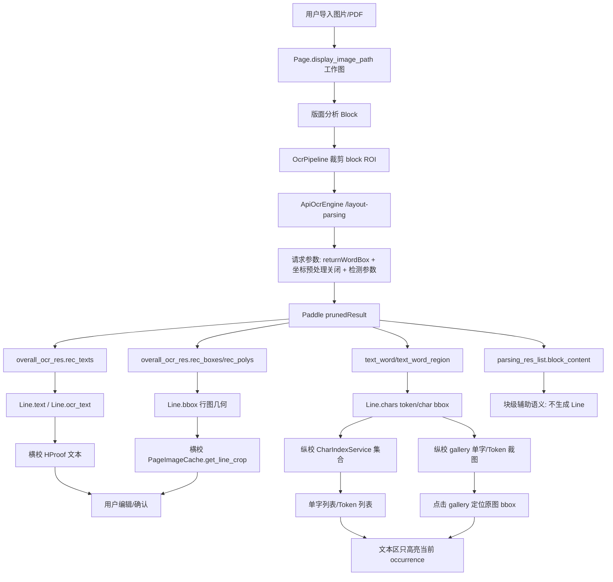

# OCR 逻辑链说明

本文档说明当前项目从 Paddle/API 请求到横校、纵校、集合和高亮的实际流转。目标是把“参数、字段、模型能力、项目处理链路”讲清楚，便于判断问题卡在哪一层。

## 1. 请求链

当前 API OCR 请求由 `app/engines/real_ocr_adapter.py::ApiOcrEngine._build_request_body()` 组装，实际发送到：

- `api_url + "/layout-parsing"`
- `Authorization: token <api_token>`
- `Content-Type: application/json`

当前实际调用的参数：

| 参数 | 当前值 | 层级 | 目的 |
| --- | --- | --- | --- |
| `file` | base64 图片 | 输入 | OCR 输入图 |
| `fileType` | `1` | 输入 | 图片类型 |
| `returnWordBox` | `true` | token/char | 要求返回 `text_word/text_word_region` |
| `useDocOrientationClassify` | `false` | 预处理 | 避免服务端旋转导致坐标漂移 |
| `useDocUnwarping` | `false` | 预处理 | 避免扭曲校正后坐标空间变化 |
| `useTextlineOrientation` | `false` | 行级 | 当前按原图坐标处理，不额外做行方向变换 |
| `textDetLimitSideLen` | `1536` | 检测 | 减少论文密集页被默认 960 下采样损伤 |
| `textDetBoxThresh` | `0.6` | 检测 | 提高检测框质量门槛，减少弱框/空框进入后链路 |
| `textDetUnclipRatio` | `1.3` | 检测 | 收紧检测框扩张，降低相邻字被包进同一框的概率 |

文档里提到但当前没有调用的参数：

- `textDetLimitType`
- `textDetThresh`
- `textRecScoreThresh`
- `visualize`
- `logId`
- PP-StructureV3 的 `useSealRecognition/useTableRecognition/useFormulaRecognition/useChartRecognition/useRegionDetection`
- layout 相关的 `layoutThreshold/layoutNms/layoutUnclipRatio/layoutMergeBboxesMode`
- markdown/export 相关参数，如 `outputFormats/prettifyMarkdown/markdownIgnoreLabels`

当前没有调用这些参数的原因是：本轮只收口 OCR proof 主链，避免继续扩大模型/输出面；其中 layout、markdown、表格、公式识别属于块级结构或导出层，不应直接影响行级 `Line` 与纵校 token。

## 2. 响应链

当前项目重点读取 `result.layoutParsingResults[]` 和 `result.ocrResults[]` 下的 `prunedResult`。

| Paddle 字段 | 官方语义 | 项目流向 | 当前适配状态 |
| --- | --- | --- | --- |
| `overall_ocr_res.rec_texts` | 行级 OCR 文本 | `Line.text` / `Line.ocr_text` | 已适配，行级主链 |
| `overall_ocr_res.rec_scores` | 行级置信度 | `Line.confidence` / 自动疑点 | 已适配 |
| `overall_ocr_res.rec_boxes` | 行级 bbox | `Line.bbox` | 已适配 |
| `overall_ocr_res.rec_polys/rec_polygons/dt_polys` | 行级 polygon/bbox | `Line.bbox` | 已兼容 |
| `text_word` | token/字文本 | `Line.chars[*].token_text` | 已适配 |
| `text_word_region` | token/字坐标 | `Line.chars[*].bbox` | 已适配 |
| `parsing_res_list.block_content` | 块级结构文本 | 仅作为块级辅助语义 | 不升成 `Line` |
| `parsing_res_list.block_bbox/block_label` | 块级结构框/标签 | 版面结构层 | 不作为行级 bbox |
| `markdown.text` | 文档级/块级输出 | 当前 proof 主链不消费 | 未接入 proof |

核心标准：

- 块级：`parsing_res_list.block_content`
- 行级：`overall_ocr_res.rec_texts + rec_boxes/rec_polys`
- token/char 级：`text_word + text_word_region`
- proof 集合：基于 `Line.text + Line.chars`，但只索引有可靠几何的行

## 3. 处理链图

## 4. 适配现状

已经适配：

- API 请求 `returnWordBox=true`
- 行级文本、置信度、行框读取
- token/word bbox 读取
- token row 与行 bbox 按 overlap 对齐，不再默认按数组下标绑定
- bbox 空窄/无墨迹过滤
- 连续数字 token 合组
- 多字符 word bbox 不伪装成精确单字框
- 无可靠行几何时保留 OCR 文本，但标记 `missing_line_bbox`，不进入纵校字符索引
- proof 消费层对同页重叠重复行去重，避免横校/纵校重复展示和重复索引
- 纵校文本区只高亮当前选中的 occurrence，不再把全文同类字全部刷蓝

尚未适配：

- `parsing_res_list.block_content` 的正式块级展示/导出承载字段
- `markdown.text` 的文档级预览/导出链
- 表格、公式、印章、图表等结构化识别输出的专门 proof 面板
- 无几何 OCR 文本的专门队列；当前只保留文本并标记疑点
- 基于真实模型输出的自动参数寻优

## 5. 本轮判断

用户反馈的残留现象主要卡在三段：

1. **重复出现**：同一 OCR 行可能以重叠 block/line 的形式进入 proof 消费层，横校、纵校文本、CharIndex 都会重复消费。本轮在 proof line 迭代层统一去重。
2. **集合仍混相邻字**：一部分来自 Paddle token bbox 本身过松，一部分来自 fallback/重复行污染。本轮收紧 `textDetUnclipRatio=1.3`，并继续跳过无可靠几何行的纵校索引。
3. **纵校高亮错位**：旧 UI 在文本区查找并高亮所有同类字符，用户点击某个单字图时看起来像“所有同类型字都高亮”。本轮改为只高亮当前 gallery entry 对应的 occurrence。

仍需后续轮次处理的问题：

- 如果 Paddle 本身把一整行切成多个单字级 `rec_texts`，仅靠 proof 消费层无法无损合并，需要在 OCR adapter 增加“同基线行合并”策略，并用真实响应回归。
- 无几何 OCR 文本当前能保住文本，但无法提供可靠行图/单字图；后续应设计“无几何文本队列”或让用户手工绑定行框。
- 公式/英文变量进入正文 proof 的问题，需要结构层先明确公式块与正文块的边界，不能在纵校集合里硬编码抹掉。
