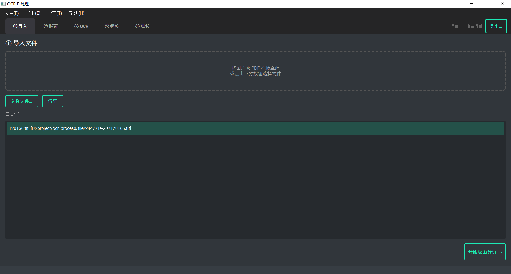
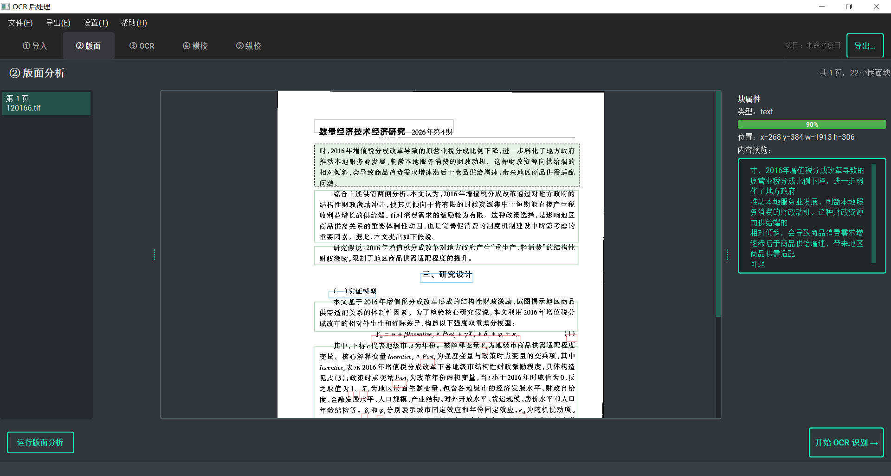
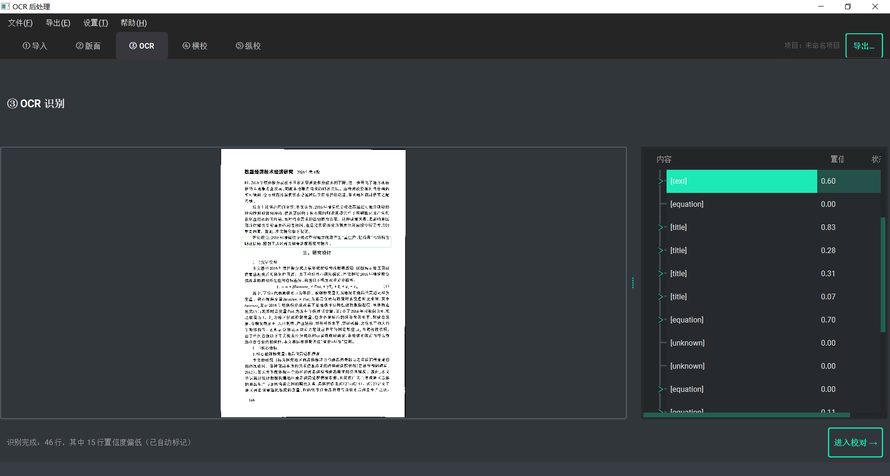
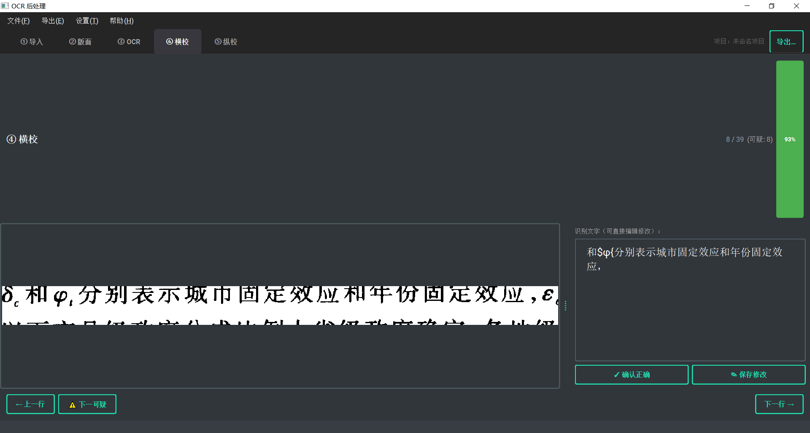
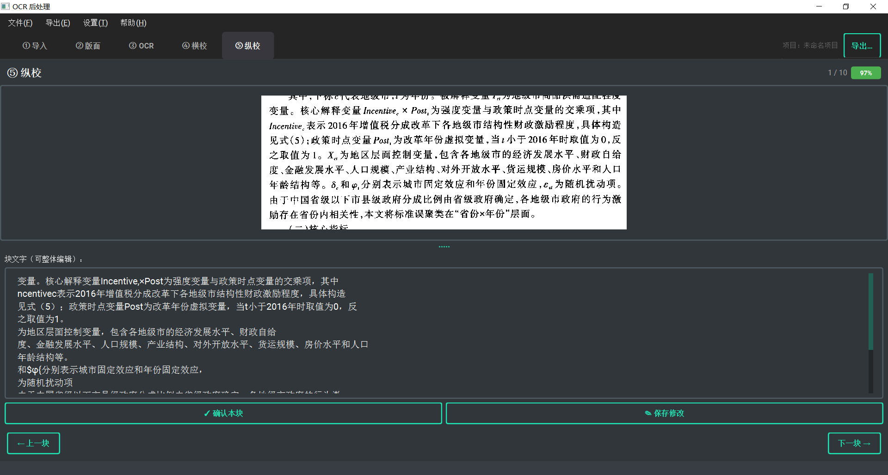

# 1、预案

## Plan: OCR 后处理桌面软件 Demo (EXE)

**TL;DR**: 用 Python + PySide6 (Qt6) 构建 Windows 桌面 EXE，PaddleOCR v3 做全栈识别（版面分析 + OCR），分四大模块逐阶段交付，PyInstaller 打包。

------

### 技术栈选型

| 层           | 选型                            | 理由                                    |
| ------------ | ------------------------------- | --------------------------------------- |
| **语言**     | Python 3.12+ + uv               | 最佳OCR生态，uv现代快速                 |
| **UI框架**   | PySide6 6.x                     | Qt6官方绑定，LGPL，2026仍活跃           |
| **UI主题**   | qt-material                     | BSD-2-Clause，现代扁平，无GPL问题       |
| **OCR/版面** | PaddleOCR v3.x (PP-StructureV3) | 中文最优，bbox+confidence+block分类一体 |
| **图像处理** | OpenCV + Pillow                 | 切图/标注                               |
| **PDF导出**  | fpdf2                           | 原生CJK支持，2026活跃，需打包字体       |
| **DOCX导出** | python-docx 1.2.x               | —                                       |
| **XML**      | lxml                            | —                                       |
| **HTML**     | Jinja2                          | 模板灵活                                |
| **RTF**      | 手写RTF字符串                   | RTF格式本身简单，无需第三方库           |
| **项目存储** | SQLite (sqlite3内置)            | 存图片路径不存Blob                      |
| **打包**     | PyInstaller 6.x                 | 比Nuitka更适合PaddleOCR大模型文件       |

------

### 目录结构

------

### 核心数据模型

`ProofStatus`: `UNCHECKED` / `AUTO_FLAGGED` / `MODIFIED` / `OK`

------

### 数据流

------

### 横校 vs 纵校 设计

- **横校**：按 `Line.bbox` 从原图裁剪行图片 → 左栏显示图片行 / 右栏可编辑文字；上/下翻行导航；低置信度字符红底高亮
- **纵校**：按 `Block` 整列裁剪 → 上栏图片 / 下栏文字；适合竖排古籍场景；按列/块导航
- 两者共用：跳转"下一个可疑"按钮、已修改标记、进度计数

------

### 阶段计划

**Phase 1 — 基础架构** *(可独立启动)*

1. `uv init` + `pyproject.toml` 配置依赖
2. 建立目录结构 + `__init__.py`
3. 实现数据模型 (`models/`)
4. 实现 `project_store.py` (建表、增删查改)
5. 搭建空主窗口 + qt-material 深色主题 + 步骤导航栏

**Phase 2 — 识别模块** *(依赖 Phase 1)*

6. 图片导入面板 (支持多图 + PDF，PDF用 PyMuPDF 转图)
7. `layout_analyzer.py` 封装 PP-StructureV3，结果写入 SQLite
8. `QGraphicsView` 图像查看器，叠加 Block bbox 框
9. `ocr_runner.py` 封装识别，QThread 异步 + 进度条
10. 属性面板：点击 Block 显示类型/置信度/文字

**Phase 3 — 校对模块** *(依赖 Phase 2)*

11. `proof_engine.py`：按 Line.bbox 切图，标记低置信 Char
12. 横校界面：QSplitter + 行图片 + 可编辑 QTextEdit，红底高亮
13. 纵校界面：同上但纵向，按 Block 导航
14. 导航栏：上一条/下一条/跳转可疑/进度显示
15. 修改后回写 SQLite (proof_status → MODIFIED)

**Phase 4 — 导出模块** *(可与 Phase 3 并行)*

16. `ExporterBase` 接口
17. TXT/RTF 导出器 *(parallel)*
18. DOCX/PDF(fpdf2+CJK字体) 导出器 *(parallel)*
19. XML(lxml)/HTML(jinja2) 导出器 *(parallel)*
20. 导出对话框 (格式多选 + 路径 + 导出)

**Phase 5 — 打包** *(依赖 Phase 1-4)*

21. 编写 PyInstaller `.spec` 文件，处理 PaddleOCR 模型路径
22. 打包测试，修复 hidden imports
23. 生成 `dist/ocr_process/` 可分发目录

------

### 关键文件

- `app/models/project.py` — 所有数据结构的中心
- `app/core/layout_analyzer.py` — PP-StructureV3 的唯一入口
- `app/core/proof_engine.py` — 横/纵校对的核心逻辑
- `app/ui/main_window.py` — 主窗口步骤导航，贯穿所有模块
- `app/ui/widgets/image_viewer.py` — 复用于版面分析和校对的图像组件
- `app/export/base.py` — 导出策略接口，所有导出器继承

------

### 验证步骤

1. `python main.py` 可启动深色主窗口
2. 导入一张扫描件图片 → 看到版面 Block 框叠加
3. OCR识别 → 文字树中可见 Line 文字 + 置信度
4. 进入横校 → 低置信行呈红色，可编辑
5. 导出 XML → 验证 bbox 坐标和文字都在 XML 里
6. `pyinstaller ocr.spec` → `dist/` 下 EXE 可独立运行

------

### 注意事项

1. **PaddleOCR 模型文件**：首次运行会自动下载到 `~/.paddleocr/`，打包时需决策：随包附带（+500MB）还是运行时下载。Demo 阶段建议运行时下载，正式版再打包。
2. **RTF**：无成熟第三方库，手写简单 RTF（纯文本+基础标签）足够 Demo 需求，后续如需富文本再升级。
3. **PDF CJK**：fpdf2 必须显式指定 TTF 字体文件路径，`resources/fonts/` 下需放一个开源中文字体（如思源黑体/Noto Sans CJK）。

# 2、实施情况

## 界面详情

---

***目前做了一个demo出来，ocr是调用的paddleocr的api进行识别，使用ocr提供的元信息进行属性框渲染位置偏移，后续校对也无法进行，正在解决***